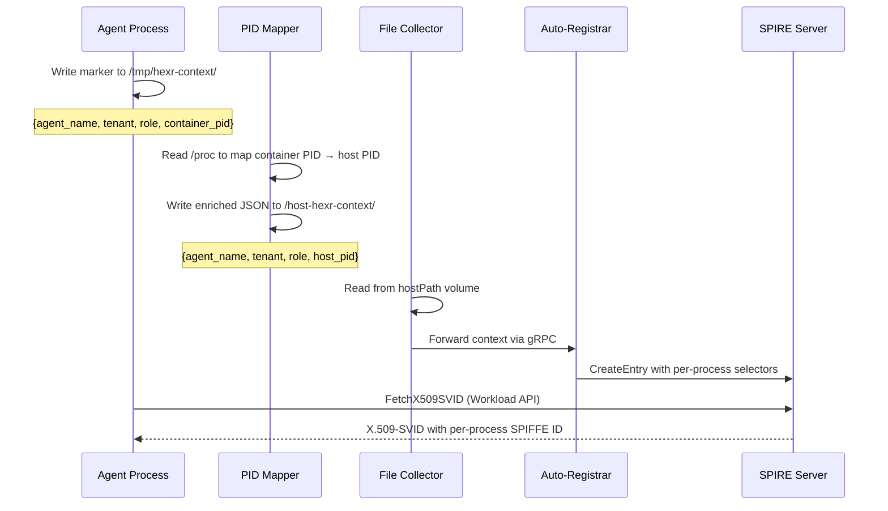
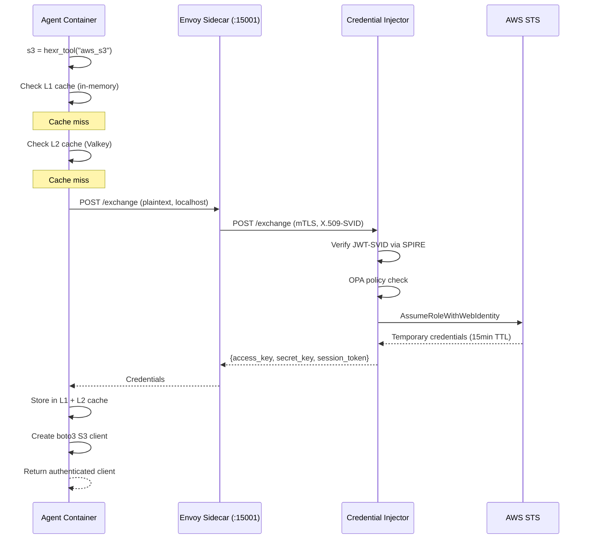

## Pod Structure

When you run `hexr deploy`, your agent becomes a Kubernetes Pod with exactly four containers plus an init container:

<Frame caption="Agent Pod — 4 containers + shared volumes">
  
</Frame>

```yaml
# Generated by hexr build (simplified)
apiVersion: v1
kind: Pod
metadata:
  name: acme-research-analyst
  namespace: tenant-acme-corp
  labels:
    hexr.io/managed: "true"
    hexr.io/tenant: "acme-corp"
    hexr.io/agent-name: "research-analyst"
spec:
  hostPID: true  # Required for per-process identity
  initContainers:
    - name: install-hexr-sdk
      # Installs SDK from private PyPI into shared volume
  containers:
    - name: agent           # Your code
    - name: envoy-sidecar   # mTLS proxy
    - name: a2a-sidecar     # Agent communication
    - name: pid-mapper       # Identity mapper
```

---

## Container Details

### 1. Agent Container

Your Python code with the Hexr SDK. This is the only container you write code for.

| Property | Value |
|----------|-------|
| **Port** | `:8080` (A2A bridge listener) |
| **Volumes** | SPIRE socket, hexr-context, shared site-packages |
| **Env vars** | `HEXR_FRAMEWORK`, `HEXR_TENANT`, `HEXR_AGENT_NAME`, `OTEL_EXPORTER_OTLP_ENDPOINT` |

```python
# What runs inside this container
@hexr_agent(name="research-analyst", tenant="acme-corp")
def analyze(topic: str):
    s3 = hexr_tool("aws_s3")          # → Envoy → Credential Injector → STS
    client = hexr_llm(openai.OpenAI()) # → OTel spans emitted
    # ... your agent logic
```

### 2. Envoy Sidecar

Transparent mTLS proxy. Handles all network traffic in and out of the pod.

| Property | Value |
|----------|-------|
| **Inbound** | `:15006` — terminates TLS, forwards plain HTTP to agent/sidecar |
| **Outbound** | `:15001` — initiates mTLS to other pods and services |
| **Certificates** | X.509-SVID from SPIRE via SDS (Secret Discovery Service) |
| **Routes** | `/.well-known/*` → Agent Card ConfigMap, `/a2a` → A2A Sidecar |

<Info>
  Envoy uses `syscall.Exec` PID inheritance — the envoy process "becomes" the proxy 
  while maintaining the correct PID for SPIRE attestation. This is a novel technique 
  described in the Hexr patent application.
</Info>

### 3. A2A Sidecar

Implements the Agent-to-Agent protocol for inter-agent communication.

| Property | Value |
|----------|-------|
| **Port** | `:8090` (JSON-RPC 2.0 endpoint) |
| **Protocol** | `message/send`, `message/stream`, `tasks/get`, `tasks/cancel` |
| **State** | Valkey-backed task store with SETNX idempotency |
| **Discovery** | Serves Agent Card at `/.well-known/agent.json` via Envoy route |

### 4. PID Mapper

Maps container PIDs to host PIDs for per-process SPIFFE identity.

| Property | Value |
|----------|-------|
| **Requires** | `hostPID: true` on the Pod spec |
| **Reads** | `/tmp/hexr-context/` — marker files written by agent process |
| **Writes** | `/host-hexr-context/` — context JSON with host PIDs for SPIRE attestation |

<Frame caption="PID Mapper flow: agent writes marker → mapper translates → SPIRE attests">

</Frame>

---

## Shared Volumes

Three volumes connect the containers:

| Volume | Mount Path | Purpose |
|--------|-----------|---------|
| `spire-agent-socket` | `/run/spire/sockets/` | SPIRE Workload API socket. Agent + Envoy use this for SVID requests. |
| `hexr-context` | `/tmp/hexr-context/` | Agent writes process identity markers. PID Mapper reads them. |
| `host-hexr-context` | `/host-hexr-context/` | PID Mapper writes host-PID-enriched context. File Collector reads from host. |

---

## Init Container

Before the main containers start, an init container installs the Hexr SDK:

```yaml
initContainers:
  - name: install-hexr-sdk
    image: python:3.11-slim
    command: ["pip", "install", "--target=/shared/site-packages", "hexr"]
    env:
      - name: PIP_INDEX_URL
        value: "https://pypi.hexr.cloud/simple/"  # Private PyPI
    volumeMounts:
      - name: shared-packages
        mountPath: /shared/site-packages
```

This ensures the SDK version matches what was used during `hexr build`, regardless of what's baked into the agent image.

---

## Network Flow

<Frame caption="How a hexr_tool('aws_s3') call flows through the pod">

</Frame>

Subsequent calls hit the L1 in-memory cache (~0.001ms) or L2 Valkey cache (~1-3ms), avoiding the full exchange round-trip.
