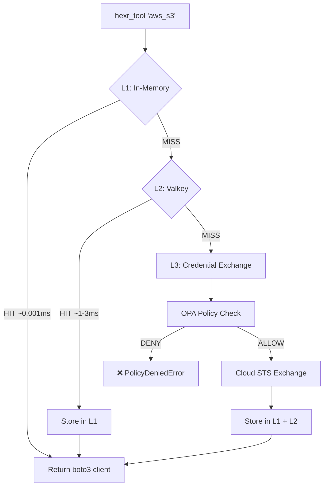
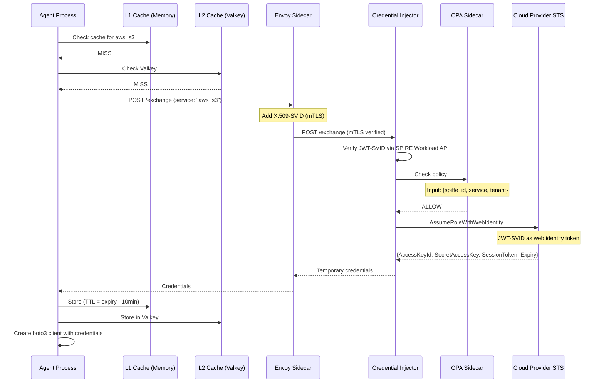

## Overview

When you call `hexr_tool("aws_s3")`, Hexr returns an authenticated boto3 S3 client — without any API keys in your code. Behind the scenes, a three-tier caching system makes this near-instantaneous.

```python
# This is all you write:
s3 = hexr_tool("aws_s3")
bucket = s3.list_buckets()

# What actually happens:
# 1. Check in-memory cache (L1) → ~0.001ms
# 2. Check Valkey cache (L2) → ~1-3ms  
# 3. Full credential exchange (L3) → ~50-200ms
#    JWT-SVID → OPA check → STS AssumeRoleWithWebIdentity
```

---

## Three-Tier Cache Architecture

<Frame>

</Frame>

### L1: In-Memory (Process-Local)

| Property | Value |
|----------|-------|
| **Latency** | ~0.001ms |
| **Scope** | Single process (ContextVar-based) |
| **TTL** | Credential expiry minus 10 minutes |
| **Size** | Bounded per process |

The fastest path. Credentials live in the Python process's memory. Dies when the process dies.

### L2: Valkey (Distributed)

| Property | Value |
|----------|-------|
| **Latency** | ~1-3ms |
| **Scope** | Cluster-wide (3-node HA) |
| **TTL** | Credential expiry minus 10 minutes |
| **Key format** | `cred:{spiffe-id}:{service}:{region}` |

Shared across all pods in the cluster. If agent A already fetched S3 credentials with the same SPIFFE scope, agent B can use the cached result.

### L3: Credential Exchange (Full Round-Trip)

| Property | Value |
|----------|-------|
| **Latency** | ~50-200ms |
| **Path** | Agent → Envoy (mTLS) → Credential Injector → OPA → Cloud STS |
| **Credentials** | Temporary (15-60 min TTL depending on provider) |

The full exchange path when both caches miss.

---

## Exchange Flow

<Frame>

</Frame>

---

## Supported Cloud Providers

<CardGroup cols={3}>
  <Card title="AWS" icon="aws">
    **Exchange:** JWT-SVID → STS `AssumeRoleWithWebIdentity`
    
    **Services:** S3, EC2, DynamoDB, SQS, Lambda, Bedrock, and any AWS SDK service.
    
    **Credential TTL:** 15 minutes (configurable up to 12 hours)
  </Card>
  <Card title="GCP" icon="google">
    **Exchange:** JWT-SVID → Workload Identity Federation → Service Account token
    
    **Services:** BigQuery, Cloud Storage, Vertex AI, Pub/Sub, and any Google Cloud API.
    
    **Credential TTL:** 1 hour
  </Card>
  <Card title="Azure" icon="microsoft">
    **Exchange:** JWT-SVID → Federated Token → Managed Identity token
    
    **Services:** Blob Storage, Cosmos DB, Azure OpenAI, and any Azure SDK service.
    
    **Credential TTL:** 1 hour
  </Card>
</CardGroup>

---

## Multi-Cloud in One Agent

An agent can use tools from multiple clouds simultaneously:

```python
@hexr_agent(
    name="multi-cloud-analyst",
    tenant="acme-corp",
    resources=["aws_s3", "gcp_bigquery", "azure_storage"]
)
def analyze():
    # Each call goes through the same credential exchange
    # but targets different cloud STSes
    s3 = hexr_tool("aws_s3")              # → AWS STS
    bq = hexr_tool("gcp_bigquery")        # → GCP WIF
    blob = hexr_tool("azure_storage")     # → Azure Federated Token
    
    # All three clients are authenticated and ready
    data = bq.query("SELECT * FROM dataset.table")
    s3.put_object(Bucket="results", Key="output.json", Body=data)
```

---

## OPA Policy Enforcement

Before any credential exchange, OPA validates the request:

```rego
# Example policy: only allow S3 access for data-pipeline agents
package hexr.credentials

default allow = false

allow {
    input.service == "aws_s3"
    startswith(input.spiffe_id, "spiffe://hexr.cloud/agent/acme-corp/data-pipeline")
}

# Deny all EC2 access
deny {
    input.service == "aws_ec2"
}
```

Policies are distributed via Kubernetes ConfigMaps and reload within 30 seconds.

---

## Proactive Refresh

A background daemon proactively refreshes credentials before they expire:

| Property | Value |
|----------|-------|
| **Check interval** | Every 60 seconds |
| **Refresh buffer** | 10 minutes before expiry |
| **Behavior** | Silent background refresh — no disruption to agent |

```
Timeline:
  T=0:00  → Credential issued (TTL: 15 min)
  T=4:00  → Background check: 11 min remaining (OK)
  T=5:00  → Background check: 10 min remaining (REFRESH!)
  T=5:01  → New credential fetched, cached in L1 + L2
  T=15:00 → Old credential would have expired (already replaced)
```

This means agents **never see credential expiry errors** during normal operation.

---

## Observability

Every cache lookup and exchange emits OpenTelemetry spans:

```
Span: hexr.cache.lookup
  ├── tier: "L1" | "L2" | "L3"
  ├── hit: true | false
  ├── service: "aws_s3"
  └── duration_ms: 0.001 | 2.3 | 150

Span: hexr.credential.exchange
  ├── provider: "aws" | "gcp" | "azure"
  ├── service: "aws_s3"
  ├── spiffe_id: "spiffe://hexr.cloud/agent/..."
  └── duration_ms: 150
```

Grafana dashboards show cache hit rates, exchange latencies, and credential refresh patterns in real-time.
