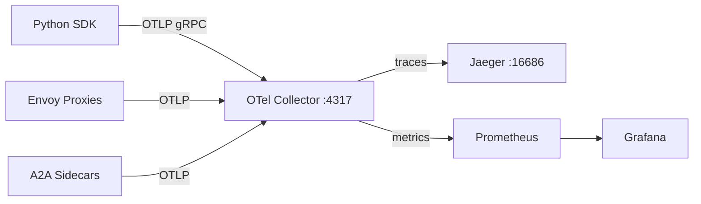
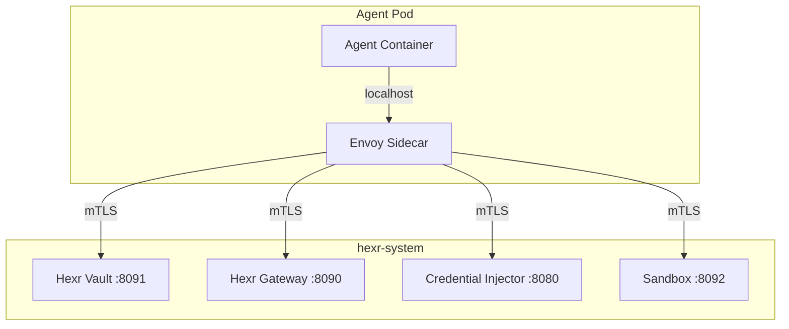

## Layer Architecture

Hexr's five layers form a dependency chain where each layer builds on the one below:

```
┌─────────────────────────────────────────────────────────┐
│  LAYER 5: MANAGEMENT                                     │
│  Dashboard · Cloud API · Identity Graph · Compliance     │
├─────────────────────────────────────────────────────────┤
│  LAYER 4: DEVELOPER EXPERIENCE                           │
│  Python SDK · CLI · Private PyPI · Agent Decorators      │
├─────────────────────────────────────────────────────────┤
│  LAYER 3: PLATFORM SERVICES                              │
│  Vault · Gateway · Credential Injector · A2A · Sandbox   │
├─────────────────────────────────────────────────────────┤
│  LAYER 2: OBSERVABILITY                                  │
│  OTel Collector · Prometheus · Jaeger · Grafana          │
├─────────────────────────────────────────────────────────┤
│  LAYER 1: IDENTITY FOUNDATION                            │
│  SPIRE Server · SPIRE Agent · Auto-Registrar · OIDC     │
└─────────────────────────────────────────────────────────┘
```

<Info>
  Each layer is deployed as independent Kubernetes workloads within the `hexr-system` namespace.
  Tenant agent pods run in isolated `tenant-{name}` namespaces.
</Info>

---

## Layer 1: Identity Foundation

The trust root for the entire platform. Without Layer 1, nothing else works.

### SPIRE Server

The certificate authority. Manages a registration entry database (PostgreSQL-backed) and issues short-lived X.509-SVIDs and JWT-SVIDs to attested workloads.

```yaml
# SPIFFE ID format for an agent process:
spiffe://hexr.cloud/agent/{tenant}/{agent-name}/{process-role}

# Examples:
spiffe://hexr.cloud/agent/acme-corp/research-analyst/main
spiffe://hexr.cloud/agent/acme-corp/content-crew/researcher
spiffe://hexr.cloud/agent/acme-corp/content-crew/writer
```

### Auto-Registrar

Watches Kubernetes for pods with `hexr.io/*` labels and automatically creates SPIRE registration entries. Supports per-process registration — multiple SPIFFE IDs per pod.

```yaml
# Labels that trigger Auto-Registrar
metadata:
  labels:
    hexr.io/managed: "true"
    hexr.io/tenant: "acme-corp"
    hexr.io/agent-name: "research-analyst"
```

### OIDC Discovery Provider

Publishes a JWKS endpoint that cloud providers (AWS, GCP, Azure) trust. This enables the JWT-SVID → cloud credential exchange without pre-shared secrets.

---

## Layer 2: Observability

Every operation across the platform emits OpenTelemetry data.

### Telemetry Pipeline

<Frame>

</Frame>

### What Gets Instrumented

| Source | Spans / Metrics |
|--------|----------------|
| `@hexr_agent` | `hexr.agent.invoke` — duration, status, framework |
| `hexr_tool()` | `hexr.tool.invoke` — service, region, cache tier hit |
| `hexr_llm()` | `hexr.llm.chat` — model, tokens in/out, latency, cost |
| Credential cache | `hexr.cache.lookup` — L1/L2/L3 hit rates, latency |
| A2A sidecar | `hexr.a2a.send` — target agent, task state, duration |
| Envoy proxy | Standard Envoy access log metrics + mTLS status |

---

## Layer 3: Platform Services

The runtime services agents interact with — usually transparently through the SDK.

### Service Mesh

<Frame>

</Frame>

All inter-service communication uses mutual TLS via Envoy proxies loaded with X.509-SVIDs from SPIRE. There are **no API keys** between services.

---

## Layer 4: Developer Experience

What you interact with as a developer.

### The Three-Command Workflow

```bash
# 1. Build: AST analysis → Dockerfile + K8s manifests + SPIFFE contexts
hexr build my_agent.py --tenant acme-corp

# 2. Push: Container build + vulnerability scan + registry push
hexr push

# 3. Deploy: Apply manifests → Pod starts with 4 containers
hexr deploy
```

### SDK Modules

| Module | Import | Purpose |
|--------|--------|---------|
| Core | `from hexr import hexr_agent, hexr_tool, hexr_llm` | Decorator, tools, LLM proxy |
| Vault | `import hexr.vault` | SPIFFE-native secrets |
| Gateway | `import hexr.gateway` | MCP tool discovery and invocation |
| Sandbox | `import hexr.sandbox` | Firecracker code execution |
| Browser | `import hexr.browser` | Headless Chromium in microVM |
| Guard | `import hexr.guard` | LLM prompt/output scanning |
| A2A | `from hexr.a2a import A2AClient` | Agent-to-agent communication |

---

## Layer 5: Management

Dashboard and APIs for platform operators.

### Dashboard Pages

| Page | Purpose |
|------|---------|
| **Agents** | Inventory of all deployed agents with status, containers, metrics |
| **Identity Graph** | WebGL visualization of all SPIFFE IDs and trust relationships |
| **Traces** | Distributed trace viewer with agent identity attribution |
| **Policies** | OPA policy management with progressive enforcement |
| **Compliance** | Framework status (SOC 2, NIST, ISO, PCI, EU AI Act) |
| **Settings** | Tenant configuration, API keys, credit management |
| **Admin** | Waitlist management, invite codes (admin only) |

### Cloud API (Hexr Cloud only)

REST API for tenant management, HCU metering, and programmatic access. Used by the CLI and dashboard.
