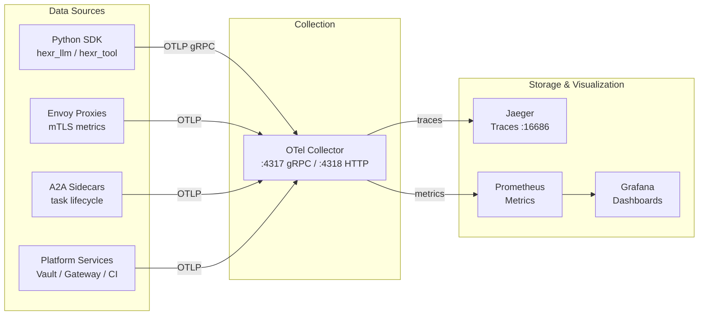

## Architecture

<Frame>

</Frame>

---

## Automatic Instrumentation

The Hexr SDK instruments everything without extra code:

```python
@hexr_agent(name="analyst", tenant="acme")
def analyze(topic: str):
    # Span: hexr.agent.invoke (auto)
    
    s3 = hexr_tool("aws_s3")
    # Span: hexr.tool.invoke {service: aws_s3}
    # Span: hexr.cache.lookup {tier: L1|L2|L3}
    # Span: hexr.credential.exchange (if cache miss)
    
    client = hexr_llm(openai.OpenAI())
    response = client.chat.completions.create(
        model="gpt-4o",
        messages=[{"role": "user", "content": f"Analyze {topic}"}]
    )
    # Span: hexr.llm.chat {model: gpt-4o, tokens_in: 42, tokens_out: 256}
    
    secret = hexr.vault.get("openai/api-key")
    # Span: hexr.vault.get {path: openai/api-key}
    
    return response
```

**Zero configuration.** All OTel providers are set up by `@hexr_agent` at decoration time.

---

## Trace Spans

| Span Name | Attributes | Source |
|-----------|-----------|--------|
| `hexr.agent.invoke` | `agent_name`, `tenant`, `framework`, `status` | `@hexr_agent` decorator |
| `hexr.tool.invoke` | `service`, `region`, `cache_tier` | `hexr_tool()` |
| `hexr.cache.lookup` | `tier` (L1/L2/L3), `hit`, `duration_ms` | Credential cache |
| `hexr.credential.exchange` | `provider`, `service`, `spiffe_id` | Credential Injector client |
| `hexr.llm.chat` | `gen_ai.system`, `gen_ai.request.model`, `gen_ai.usage.input_tokens`, `gen_ai.usage.output_tokens` | `hexr_llm()` proxy |
| `hexr.vault.get` | `path`, `tenant` | `hexr.vault` module |
| `hexr.gateway.call` | `tool_name`, `arguments` | `hexr.gateway` module |
| `hexr.a2a.client.send` | `target_agent`, `task_id`, `task_state` | `A2AClient` |
| `hexr.a2a.bridge.execute` | `source_agent`, `task_id` | A2A Bridge |
| `hexr.sandbox.exec` | `language`, `timeout`, `exit_code` | `hexr.sandbox` |
| `hexr.browser.browse` | `url`, `actions_count` | `hexr.browser` |
| `hexr.guard.scan` | `scan_type` (prompt/output), `is_valid` | `hexr.guard` |

---

## Metrics

### Agent Metrics

| Metric | Type | Description |
|--------|------|-------------|
| `hexr.agent.invocations` | Counter | Total agent invocations |
| `hexr.agent.active` | UpDownCounter | Currently active invocations |
| `hexr.agent.duration` | Histogram | Invocation duration in seconds |

### Tool & Credential Metrics

| Metric | Type | Description |
|--------|------|-------------|
| `hexr.tool.invocations` | Counter | Total tool calls by service |
| `hexr.tool.duration` | Histogram | Tool call duration |
| `hexr.cache.hits` | Counter | Cache hits by tier (L1/L2/L3) |
| `hexr.cache.misses` | Counter | Cache misses |
| `hexr.cache.lookup.duration` | Histogram | Cache lookup latency |
| `hexr.credential.exchanges` | Counter | Full credential exchanges |
| `hexr.credential.failures` | Counter | Failed exchanges |

### LLM Metrics

| Metric | Type | Description |
|--------|------|-------------|
| `hexr.llm.calls` | Counter | Total LLM API calls |
| `hexr.llm.call_errors` | Counter | Failed LLM calls |
| `hexr.llm.call.duration` | Histogram | LLM call latency |
| `hexr.llm.input_tokens` | Counter | Total input tokens |
| `hexr.llm.output_tokens` | Counter | Total output tokens |

### A2A Metrics

| Metric | Type | Description |
|--------|------|-------------|
| `hexr.a2a.sends` | Counter | Messages sent |
| `hexr.a2a.send_failures` | Counter | Failed sends |
| `hexr.a2a.send.duration` | Histogram | Send latency |
| `hexr.a2a.bridge.executions` | Counter | Bridge handler calls |

---

## Grafana Dashboards

Hexr ships with two pre-built Grafana dashboards:

### Platform Overview (23 panels)

Covers system-wide health:
- Agent pod status and container health
- Credential exchange rates and cache hit ratios
- mTLS connection counts and TLS handshake latency
- SPIRE entry counts and SVID rotation rates
- OTel Collector throughput (traces/sec, metrics/sec)
- Vault operation rates and latency
- Gateway tool invocation rates

### A2A Communication (19 panels)

Covers inter-agent messaging:
- Task lifecycle (submitted → working → completed/failed)
- Message throughput per agent pair
- Task duration histograms
- SSE streaming connection counts
- Valkey task store operations
- Error rates by task state transition
- Cross-namespace communication patterns

---

## GenAI Semantic Conventions

`hexr_llm()` follows the [OpenTelemetry GenAI semantic conventions](https://opentelemetry.io/docs/specs/semconv/gen-ai/):

| Attribute | Example Value |
|-----------|---------------|
| `gen_ai.system` | `openai`, `anthropic`, `google_genai`, `cohere`, `mistral` |
| `gen_ai.request.model` | `gpt-4o`, `claude-3-opus`, `gemini-pro` |
| `gen_ai.response.model` | `gpt-4o-2024-08-06` |
| `gen_ai.usage.input_tokens` | `1200` |
| `gen_ai.usage.output_tokens` | `800` |
| `gen_ai.response.id` | `chatcmpl-abc123` |
| `gen_ai.response.finish_reasons` | `["stop"]` |

This means your Hexr traces are compatible with any OTel-native LLM observability tool.

---

## Prometheus Scrape Targets

| Target | Labels | Metrics |
|--------|--------|---------|
| A2A Sidecars | `namespace=tenant-*` | Task lifecycle, message throughput |
| Credential Injector | `namespace=hexr-system` | Exchange rates, OPA decisions |
| Gateway | `namespace=hexr-system` | Tool calls, import counts |
| Vault | `namespace=hexr-system` | Secret operations, encryption |
| OTel Collector | `namespace=hexr-system` | Collector health, pipeline stats |
