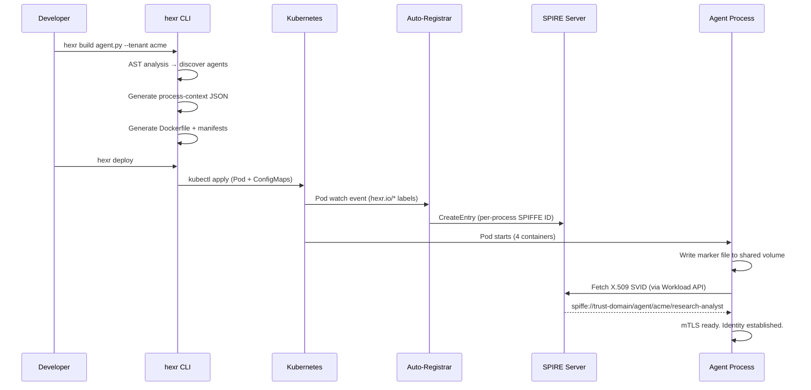
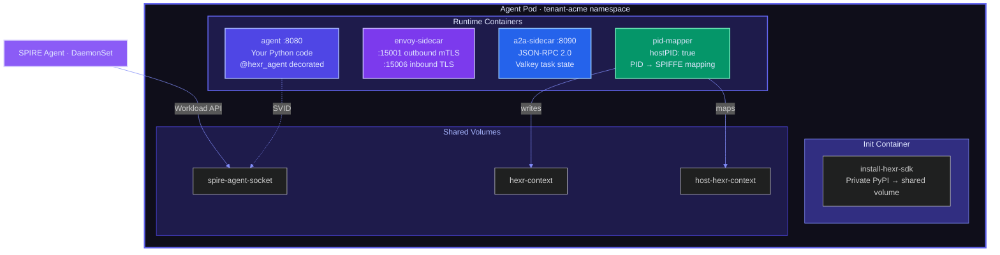

## The Big Picture

Hexr wraps your AI agent in production-grade infrastructure automatically. When you write `@hexr_agent` and run `hexr deploy`, your single Python file becomes a fully instrumented Kubernetes workload with:

- **Cryptographic identity** (SPIFFE X.509 + JWT certificates)
- **Mutual TLS** to every other service (via Envoy sidecar)  
- **Authenticated cloud credentials** (AWS, GCP, Azure — no API keys in code)
- **Distributed tracing** (OpenTelemetry spans for every operation)
- **Agent-to-agent communication** (JSON-RPC 2.0 over mTLS)
- **Policy enforcement** (OPA at every service boundary)

---

## Five-Layer Platform Stack

```mermaid
%%{init: {'theme': 'dark', 'themeVariables': {'primaryColor': '#6366F1', 'primaryTextColor': '#fff', 'primaryBorderColor': '#818CF8', 'lineColor': '#818CF8', 'secondaryColor': '#1E1B4B', 'tertiaryColor': '#312E81'}}}%%
graph TB
    subgraph L5["LAYER 5 · Management"]
        direction LR
        DASH["Dashboard"]
        CAPI["Cloud API"]
        GRAPH["Identity Graph"]
        COMP["Compliance Engine"]
    end

    subgraph L4["LAYER 4 · Developer Experience"]
        direction LR
        CLI["hexr build / push / deploy"]
        SDK["Python SDK · @hexr_agent"]
        PYPI["Private PyPI"]
    end

    subgraph L3["LAYER 3 · Platform Services"]
        direction LR
        VAULT["Hexr Vault :8091"]
        GW["Hexr Gateway :8090"]
        CI2["Credential Injector :8080"]
        A2A2["A2A Sidecar :8090"]
        SB2["Sandbox :8092"]
        GUARD["LLM Guard :8000"]
        ENVOY2["Envoy Proxy"]
        VALKEY["Valkey 3-node HA"]
    end

    subgraph L2["LAYER 2 · Observability"]
        direction LR
        OTEL["OTel Collector"]
        PROM["Prometheus"]
        JAEG["Jaeger"]
        GRAF["Grafana · 42 panels"]
    end

    subgraph L1["LAYER 1 · Identity Foundation"]
        direction LR
        SPIRES["SPIRE Server"]
        SPIREA["SPIRE Agent · DaemonSet"]
        OIDC["OIDC Provider"]
        AUTOREG["Auto-Registrar"]
        FILECOL["File Collector · DaemonSet"]
    end

    L5 --> L4
    L4 --> L3
    L3 --> L2
    L2 --> L1

    style L5 fill:#3730A3,stroke:#818CF8,stroke-width:2px,color:#E0E7FF
    style L4 fill:#4F46E5,stroke:#818CF8,stroke-width:2px,color:#E0E7FF
    style L3 fill:#6366F1,stroke:#A5B4FC,stroke-width:2px,color:#E0E7FF
    style L2 fill:#7C3AED,stroke:#C4B5FD,stroke-width:2px,color:#E0E7FF
    style L1 fill:#8B5CF6,stroke:#DDD6FE,stroke-width:2px,color:#E0E7FF
```

Every Hexr deployment — cloud or self-hosted — consists of these five layers:

<AccordionGroup>
  <Accordion title="Layer 1: Identity Foundation" icon="fingerprint">
    The trust root. Every process in the cluster gets a cryptographic identity.

    | Component | Purpose |
    |-----------|---------|
    | **SPIRE Server** | Certificate authority. Issues X.509 and JWT SVIDs. PostgreSQL-backed. |
    | **SPIRE Agent** | DaemonSet (one per node). Handles workload attestation and SVID rotation. |
    | **Auto-Registrar** | Watches for pods with `hexr.io/*` labels. Creates SPIRE registration entries per-process. |
    | **OIDC Discovery** | JWKS endpoint for federated auth with AWS STS, GCP WIF, Azure AD. |
    | **Pod UID Attestor** | Custom SPIRE plugin. Reads process context files for per-process selectors. |
    | **File Collector** | DaemonSet. Forwards process context JSON from host paths to Auto-Registrar. |
  </Accordion>

  <Accordion title="Layer 2: Observability" icon="chart-mixed">
    Full telemetry pipeline — traces, metrics, and dashboards for every agent operation.

    | Component | Purpose |
    |-----------|---------|
    | **OTel Collector** | OTLP gRPC/HTTP aggregation. Receives from SDK + Envoy proxies. |
    | **Prometheus** | Metrics storage. 11+ scrape targets across system and tenant namespaces. |
    | **Jaeger** | Distributed tracing. Cross-agent span correlation. |
    | **Grafana** | 42 panels across 2 dashboards: platform overview + A2A communication. |
  </Accordion>

  <Accordion title="Layer 3: Platform Services" icon="cubes">
    The runtime services that your agents interact with transparently.

    | Component | Port | Purpose |
    |-----------|------|---------|
    | **Hexr Vault** | 8091 | SPIFFE-native secrets. AES-256-GCM encryption. OPA-enforced isolation. |
    | **Hexr Gateway** | 8090 | OpenAPI → MCP tool adapter. Registers tools, injects credentials from Vault. |
    | **Credential Injector** | 8080 | JWT-SVID → AWS STS / GCP WIF / Azure FT exchange. 3-tier credential cache. |
    | **A2A Sidecar** | 8090 | JSON-RPC 2.0 inter-agent protocol. Valkey-backed task state. |
    | **Sandbox** | 8092 | Firecracker microVM code execution + headless Chromium browser. |
    | **LLM Guard** | 8000 | Prompt injection detection, secret scanning, invisible text detection. |
    | **Envoy Proxy** | 15001/6 | mTLS mesh. Certificate rotation via SPIRE SDS. |
    | **Valkey** | 6379 | 3-node HA. Credential L2 cache + A2A task state. |
  </Accordion>

  <Accordion title="Layer 4: Developer Experience" icon="code">
    The SDK and CLI that developers interact with directly.

    | Component | Purpose |
    |-----------|---------|
    | **Python SDK** | `@hexr_agent`, `hexr_tool()`, `hexr_llm()`, `hexr.vault`, `hexr.gateway`, etc. |
    | **CLI** | `hexr build`, `hexr push`, `hexr deploy`, `hexr audit`, `hexr login` |
    | **Private PyPI** | SDK distribution. Agents install from private registry during pod init. |
  </Accordion>

  <Accordion title="Layer 5: Management" icon="gauge-high">
    The dashboard and APIs for operators and administrators.

    | Component | Purpose |
    |-----------|---------|
    | **Dashboard** | Next.js web UI. Agent inventory, identity graph, compliance, traces, admin. |
    | **Cloud API** | Tenant management, HCU metering, API keys, waitlist, invite codes. |
    | **Identity Graph** | WebGL-rendered graph of all agents, services, and trust relationships. |
    | **Compliance Engine** | 5 frameworks (SOC 2, NIST, ISO, PCI, EU AI Act) mapped to OPA policies. |
  </Accordion>
</AccordionGroup>

---

## How Identity Flows

<Frame caption="Identity cascade: from decorator to SPIFFE SVID">

</Frame>

<Info>
  **Per-process, not per-container.** Hexr assigns SPIFFE identities to individual agent processes 
  within a container — not just the pod or container. This enables identity attribution for 
  multi-agent frameworks where multiple agents run in a single process tree.
</Info>

---

## Agent Pod Architecture

Every deployed agent runs as a Kubernetes Pod with 4 containers:

| Container | Purpose | Key Responsibilities |
|-----------|---------|---------------------|
| **agent** | Your Python code | Runs `@hexr_agent`-decorated function. Listens on `:8080` for A2A bridge calls. |
| **envoy-sidecar** | mTLS proxy | Terminates inbound TLS (`:15006`), initiates outbound mTLS (`:15001`). Loads X.509-SVIDs via SPIRE SDS. |
| **a2a-sidecar** | Agent communication | JSON-RPC 2.0 dispatch (`:8090`). Task state in Valkey. SSE streaming. Prometheus metrics. |
| **pid-mapper** | Identity mapper | Reads `/proc` (hostPID), maps container PIDs to host PIDs, writes context JSON for SPIRE attestation. |

Shared volumes connect them:
- **Identity Socket** — SPIRE Agent Workload API (`/run/spire/sockets/agent.sock`)
- **Context Volume** — Process context JSON files (`/tmp/hexr-context/`)  
- **Host Volume** — Host PID namespace mapping (`/host-hexr-context/`)

---

## Next Steps

<CardGroup cols={2}>
  <Card title="Per-Process Identity" icon="id-card" href="/architecture/per-process-identity">
    Deep dive into how SPIFFE IDs are assigned to individual agent processes.
  </Card>
  <Card title="Credential Exchange" icon="right-left" href="/architecture/credential-exchange">
    How the 3-tier cache delivers sub-millisecond cloud credentials.
  </Card>
</CardGroup>
