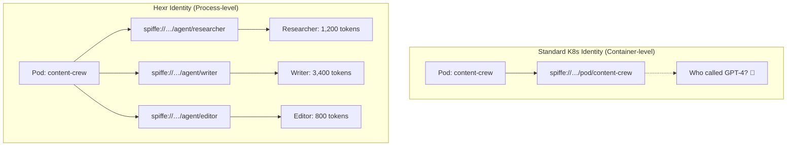
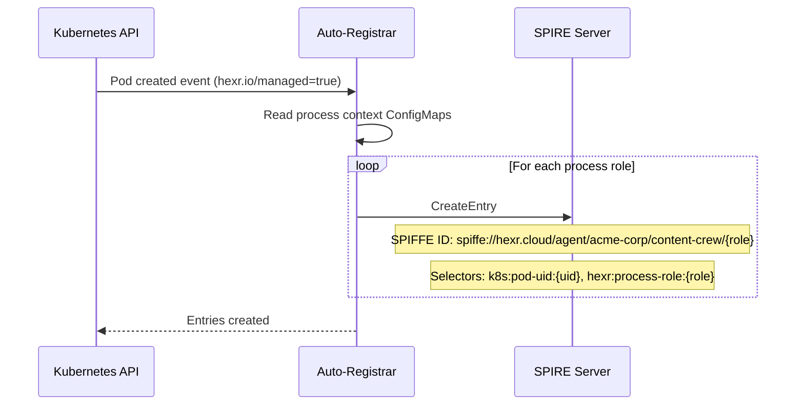

## Why Per-Process?

Most Kubernetes identity systems assign one identity per pod (or at best, per container). Hexr goes further: **every agent process gets its own SPIFFE ID**.

This matters because:

- **Multi-agent frameworks** (CrewAI, LangChain) run multiple agents in one process tree
- **Sub-agents** (researcher, writer, editor) need distinct identities for access control
- **Audit trails** need to know which specific agent made which API call
- **Cost attribution** needs per-agent LLM token tracking

<Frame>

</Frame>

---

## SPIFFE ID Format

Every agent process receives a SPIFFE ID following this pattern:

```
spiffe://{trust-domain}/agent/{tenant}/{agent-name}/{process-role}
```

| Component | Description | Example |
|-----------|-------------|---------|
| `trust-domain` | Your SPIRE trust domain | `hexr.cloud`, `acme.example.com` |
| `tenant` | Tenant namespace | `acme-corp` |
| `agent-name` | Agent name from `@hexr_agent(name=...)` | `content-crew` |
| `process-role` | Sub-agent role (main, researcher, writer, etc.) | `researcher` |

**Examples:**
```
spiffe://hexr.cloud/agent/acme-corp/research-analyst/main
spiffe://hexr.cloud/agent/acme-corp/content-crew/researcher
spiffe://hexr.cloud/agent/acme-corp/content-crew/writer
spiffe://hexr.cloud/agent/acme-corp/content-crew/editor
```

---

## How It Works

The identity lifecycle has four stages:

### Stage 1: Build-Time Discovery

`hexr build` performs AST analysis on your Python source code to discover all agents:

```bash
$ hexr build content_crew.py --tenant acme-corp
```

```
Discovered agents:
  content-crew (CrewAI framework)
    ├── researcher (Agent role)
    ├── writer (Agent role)  
    └── editor (Agent role)

Generated:
  .hexr/process-contexts/
    ├── researcher.json
    ├── writer.json
    └── editor.json
```

Each process context file contains the template for SPIRE registration:

```json
{
  "agent_name": "content-crew",
  "tenant": "acme-corp",
  "process_role": "researcher",
  "framework": "crewai",
  "trust_domain": "hexr.cloud"
}
```

### Stage 2: Pod Startup & Registration

When the pod starts, the Auto-Registrar creates SPIRE entries:

<Frame>

</Frame>

### Stage 3: Runtime Marker Files

When the agent process starts, the SDK writes a marker file:

```python
# Inside @hexr_agent decorator — happens automatically
HexrContext.set_agent_context(
    agent_name="content-crew",
    tenant="acme-corp",
    framework="crewai",
    resources=["aws_s3", "gcp_bigquery"]
)
# Writes: /tmp/hexr-context/content-crew-researcher.json
```

The PID mapper reads this marker, maps the container PID to the host PID using `/proc`, and writes the enriched context:

```json
{
  "agent_name": "content-crew",
  "process_role": "researcher",
  "container_pid": 42,
  "host_pid": 83721,
  "tenant": "acme-corp"
}
```

### Stage 4: SVID Issuance

The agent process fetches its SVID from the SPIRE Workload API:

```python
# Automatic — SDK handles this
svid = spire_workload_api.FetchX509SVID()
# Returns: X.509 certificate with:
#   Subject: spiffe://hexr.cloud/agent/acme-corp/content-crew/researcher
#   Valid: 1 hour (auto-rotated)
```

This SVID is used for:
- **mTLS** — Envoy loads it via SDS for encrypted communication
- **JWT exchange** — Credential Injector verifies it for cloud credential access
- **Audit** — Every action is attributed to this specific process identity

---

## Identity in Practice

### Cloud Credential Scoping

Each process identity can be scoped to specific cloud resources:

```python
@hexr_agent(
    name="data-pipeline",
    tenant="acme-corp",
    resources=["aws_s3:read", "gcp_bigquery:query"]  # Only S3 read + BQ query
)
def pipeline(query: str):
    s3 = hexr_tool("aws_s3")          # ✅ Allowed (read-only S3)
    bq = hexr_tool("gcp_bigquery")    # ✅ Allowed (query-only BQ)
    ec2 = hexr_tool("aws_ec2")        # ❌ Denied by OPA policy
```

### Multi-Agent Cost Attribution

With `hexr_llm()`, every LLM call is tagged with the calling process's SPIFFE ID:

```
Trace: content-crew run #47
├── spiffe://…/content-crew/researcher
│   └── GPT-4o: 1,200 input + 800 output tokens ($0.028)
├── spiffe://…/content-crew/writer
│   └── GPT-4o: 3,400 input + 2,100 output tokens ($0.089)  
└── spiffe://…/content-crew/editor
    └── GPT-4o: 800 input + 400 output tokens ($0.019)

Total: $0.136 for this run
```

### A2A Communication Identity

When agents communicate across pods, mTLS ensures both parties have verified identities:

```
Agent A: spiffe://hexr.cloud/agent/acme-corp/orchestrator/main
    → mTLS →
Agent B: spiffe://hexr.cloud/agent/acme-corp/data-analyst/main

Both sides verified. No API keys. No tokens. Pure cryptographic identity.
```

---

## Security Implications

| Property | Benefit |
|----------|---------|
| **No shared credentials** | Each process has its own short-lived X.509 certificate |
| **Auto-rotation** | SVIDs rotate every hour automatically |
| **Revocation** | Delete the SPIRE entry → identity immediately invalid |
| **Audit trail** | Every operation traced to a specific process, not just a pod |
| **Lateral movement prevention** | Process A can't impersonate Process B — different SPIFFE IDs |
| **Blast radius containment** | Compromised process only has access to its scoped resources |
