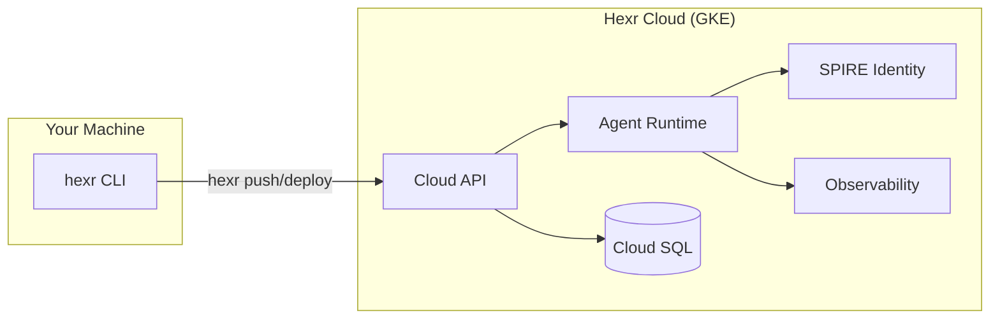
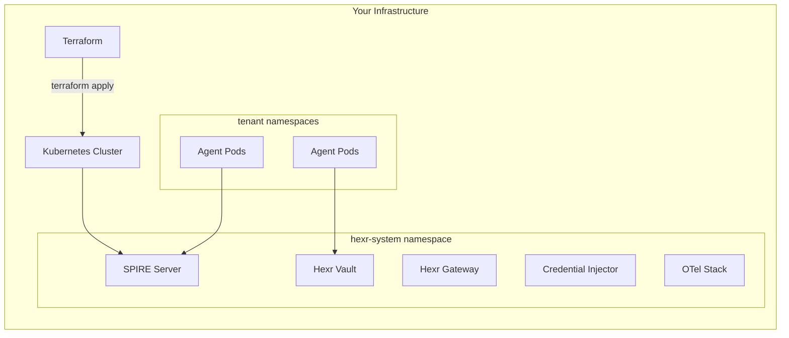
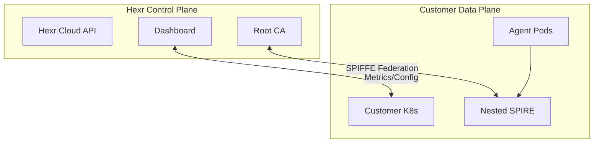

## Deployment Comparison

| | Hexr Cloud | Hybrid | Self-Hosted | Air-Gapped |
|---|---|---|---|---|
| **Infrastructure** | Hexr-managed GKE | Your runtime + Hexr control plane | Your cluster | Your cluster, zero internet |
| **Trust Domain** | `hexr.cloud` | Federated | Customer-owned | Customer-owned |
| **Identity** | Hexr root CA | SPIFFE Federation | Customer SPIRE | Customer SPIRE |
| **Billing** | HCU credits | HCU + infrastructure | License | License |
| **Setup Time** | 5 minutes | 1 hour | 2-4 hours | 2-4 hours |
| **Auth** | SSO / API keys | SSO + SPIFFE Federation | LDAP/AD/SAML/OIDC | LDAP/AD/SAML |
| **Status** | ✅ Available | 🔜 Coming Soon | ✅ Available | ✅ Available |

---

## Hexr Cloud (Managed SaaS)

<Frame>

</Frame>

Everything managed by Hexr. You write agents, we handle the rest.

- **Sign up** at [hexr.dev](https://hexr.dev) → get an API key
- **`hexr login`** → authenticate your CLI
- **`hexr build && hexr push --cloud && hexr deploy --cloud`** → agent running
- **Dashboard** at [app.hexr.cloud](https://app.hexr.cloud) → monitor everything
- **Pay** with Hexr Compute Units (HCU) — metered per operation

<Card title="Get Started with Hexr Cloud" icon="cloud" href="/cloud/quickstart" />

---

## Self-Hosted (On-Premises / Private Cloud)

<Frame>

</Frame>

Your infrastructure, your data, your control. Hexr ships as Terraform modules + Helm charts.

- **Terraform** provisions cloud resources (VPC, K8s cluster, databases, DNS)
- **Helm** deploys the Hexr runtime (SPIRE, Vault, Gateway, Observability)
- **Works on** AWS EKS, GCP GKE, Azure AKS, bare-metal K8s, DigitalOcean
- **Air-gapped** mode: zero outbound connectivity, all images pre-loaded

<Card title="Self-Hosted Quickstart" icon="server" href="/self-hosted/quickstart" />

---

## Hybrid Cloud (Coming Soon)

<Frame>

</Frame>

Your agents run in your infrastructure. Hexr manages identity, observability, and tooling from the cloud. SPIFFE federation bridges trust domains without exposing credentials.

- **Nested SPIRE**: Your SPIRE server federates with Hexr's root CA
- **Data stays local**: Agent compute never leaves your network
- **Control plane**: Dashboard, compliance, and config managed by Hexr
- **Available**: Post-funding, additive to self-hosted (not a redesign)

---

## Architecture Guarantee

Hexr is designed so that **hybrid is additive, not a redesign**. The same Helm charts and agent code work across all models. Moving between deployment models requires changing configuration, not code.

```
Today:
  hexr.cloud trust domain  →  Hexr Cloud SaaS
  acme.example.com         →  Self-Hosted (Terraform + Helm)

Post-funding (additive):
  hexr.cloud ⟷ acme.example.com  →  SPIFFE Federation (config change only)
```
