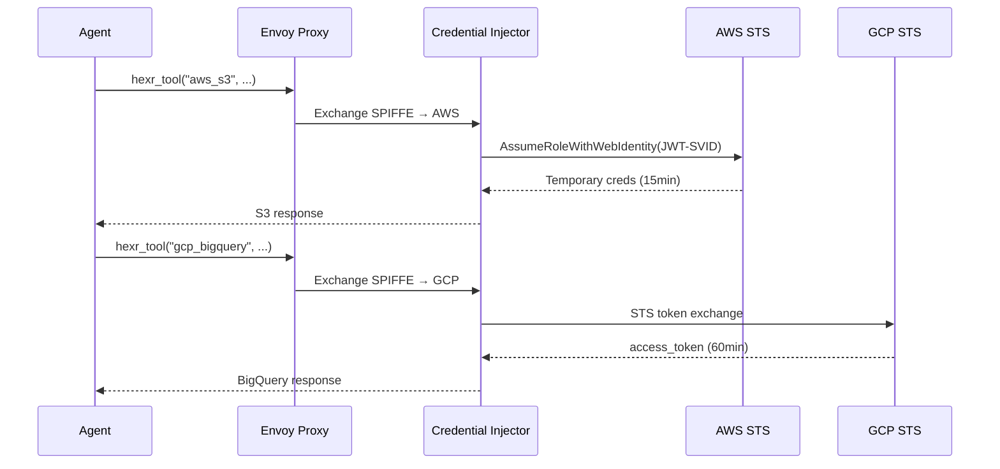

## The Problem

Traditional agents need cloud credentials hardcoded or injected via environment variables:

```python
# ❌ The old way — credentials everywhere
import boto3
session = boto3.Session(
    aws_access_key_id="AKIA...",        # Leaked in git
    aws_secret_access_key="wJalr...",   # Rotated manually
)
```

## The Hexr Way

```python
# ✅ The Hexr way — identity-based access
from hexr import hexr_agent, hexr_tool

@hexr_agent(name="multi-cloud-agent", tenant="acme-corp")
def main():
    # AWS — automatic STS credential exchange
    s3_data = hexr_tool("aws_s3", action="get_object",
                        bucket="reports", key="sales.csv")

    # GCP — automatic Workload Identity Federation
    bq_data = hexr_tool("gcp_bigquery", 
                        query="SELECT * FROM dataset.table LIMIT 10")

    # Azure — automatic federated identity
    blob = hexr_tool("azure_storage",
                     action="download_blob",
                     container="data", blob="report.pdf")
```

**Zero credentials in your code.** The platform exchanges your agent's SPIFFE identity for short-lived cloud tokens automatically.

---

## How It Works



---

## Setup

### Build with Multi-Cloud

```bash
hexr build agent.py --tenant acme-corp --multi-cloud aws,gcp,azure
```

### Cloud Provider Configuration

<AccordionGroup>
  <Accordion title="AWS">
    1. Create an IAM OIDC Identity Provider pointing to `oidc.hexr.cloud`
    2. Create an IAM Role with a trust policy for your agent's SPIFFE ID
    3. Configure the role ARN in Helm values:
    ```yaml
    credentialInjector:
      aws:
        roleArn: arn:aws:iam::123456789:role/hexr-agent-role
    ```
  </Accordion>
  <Accordion title="GCP">
    1. Create a Workload Identity Pool
    2. Add an OIDC Provider pointing to `oidc.hexr.cloud`
    3. Create a service account and grant the pool access
    4. Configure in Helm values:
    ```yaml
    credentialInjector:
      gcp:
        workloadIdentityProvider: projects/123/locations/global/workloadIdentityPools/hexr/providers/spire
    ```
  </Accordion>
  <Accordion title="Azure">
    1. Create an App Registration with Federated Identity Credentials
    2. Set the issuer to `oidc.hexr.cloud`
    3. Configure in Helm values:
    ```yaml
    credentialInjector:
      azure:
        tenantId: "xxxxxxxx-xxxx-xxxx-xxxx-xxxxxxxxxxxx"
        clientId: "xxxxxxxx-xxxx-xxxx-xxxx-xxxxxxxxxxxx"
    ```
  </Accordion>
</AccordionGroup>

---

## Per-Process Cloud Access

In a CrewAI crew, each role can have different cloud permissions:

```python
@hexr_agent(name="data-crew", tenant="acme", framework="crewai")
def main():
    # researcher → spiffe://.../data-crew/researcher → BigQuery read-only
    # writer → spiffe://.../data-crew/writer → S3 write-only
    # No code changes needed — OPA policies enforce the scoping
    ...
```
