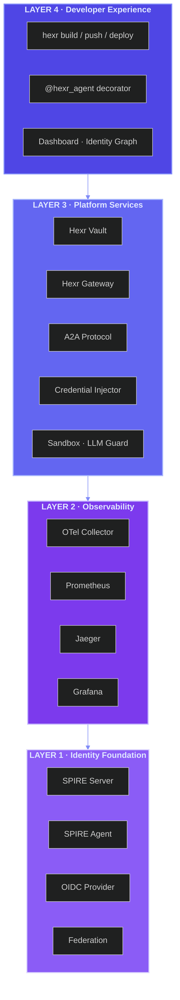

## Choose Your Deployment Model

Hexr runs the same agent runtime everywhere — the only difference is who manages the infrastructure.

<CardGroup cols={2}>
  <Card
    title="Hexr Cloud"
    icon="cloud"
    href="/cloud/quickstart"
  >
    Fully managed SaaS on GKE. Sign up, get an API key, and deploy agents in minutes. 
    Pay-as-you-go with Hexr Compute Units (HCU).
  </Card>
  <Card
    title="Self-Hosted"
    icon="server"
    href="/self-hosted/quickstart"
  >
    Deploy Hexr in your own infrastructure with Terraform + Helm. 
    Air-gapped, on-premises, or private cloud. You own everything.
  </Card>
</CardGroup>

<Card
  title="Hybrid Cloud (Coming Soon)"
  icon="cloud-arrow-up"
  color="#94a3b8"
>
  Your agents run in your infrastructure. Hexr manages the control plane. 
  SPIFFE federation bridges the trust boundary. Best of both worlds.
</Card>

---

## What is Hexr?

Hexr is a **runtime platform** that gives every AI agent a cryptographic identity, secure access to cloud tools, and full observability — without changing your agent code.

```python
from hexr import hexr_agent, hexr_tool, hexr_llm
import openai

@hexr_agent(name="research-analyst", tenant="acme-corp")
def analyze(topic: str):
    # Authenticated S3 client — no API keys in code
    s3 = hexr_tool("aws_s3")
    
    # LLM calls auto-traced with cost attribution
    client = hexr_llm(openai.OpenAI())
    
    response = client.chat.completions.create(
        model="gpt-4o",
        messages=[{"role": "user", "content": f"Analyze {topic}"}]
    )
    return response.choices[0].message.content
```

One decorator. Zero credential management. Full telemetry.

---

## Platform at a Glance

<CardGroup cols={3}>
  <Card title="Identity" icon="fingerprint">
    Every agent process gets a unique SPIFFE identity — not just the container, the **process**.
    Mutual TLS everywhere. Zero-trust by default.
  </Card>
  <Card title="Credentials" icon="key">
    `hexr_tool("aws_s3")` returns an authenticated boto3 client. 
    Three-tier cache: in-memory → Valkey → STS exchange. Sub-millisecond.
  </Card>
  <Card title="Observability" icon="chart-mixed">
    `hexr_llm()` wraps any LLM client with OpenTelemetry spans. 
    Per-agent cost attribution, token tracking, latency histograms.
  </Card>
  <Card title="Communication" icon="messages">
    Built-in A2A protocol with JSON-RPC 2.0 sidecar. 
    Agent discovery, task lifecycle, SSE streaming — all over mTLS.
  </Card>
  <Card title="Secrets" icon="vault">
    SPIFFE-native vault. No API keys — your identity IS the key. 
    AES-256-GCM encryption. OPA policy enforcement at every boundary.
  </Card>
  <Card title="Tools" icon="wrench">
    Import any OpenAPI spec → MCP tools. Call them with SPIFFE authentication. 
    Gateway handles credential injection from Vault automatically.
  </Card>
  <Card title="Sandbox" icon="box">
    `hexr.sandbox.exec()` runs code in Firecracker microVMs. 
    Hardware isolation. No SPIFFE access from inside the sandbox.
  </Card>
  <Card title="Browser" icon="globe">
    `hexr.browser.browse()` launches headless Chromium in a microVM. 
    Playwright-powered. Screenshot, extract, click — all isolated.
  </Card>
  <Card title="Guard" icon="shield-halved">
    LLM Guard scans every prompt and response. 
    Prompt injection detection, secret scanning, invisible text detection.
  </Card>
</CardGroup>

---

## Framework Agnostic

Write agents with any Python framework. Hexr detects and adapts automatically.

<CardGroup cols={3}>
  <Card title="CrewAI" icon="users-gear">
    Multi-agent crews with role-based agents.
  </Card>
  <Card title="LangChain" icon="link">
    Chains, agents, and tools with LangGraph orchestration.
  </Card>
  <Card title="AutoGen" icon="robot">
    Multi-agent conversation patterns.
  </Card>
  <Card title="Strands Agents" icon="dna">
    AWS-native agent framework with tool decorators.
  </Card>
  <Card title="OpenAI Swarm" icon="bees">
    Lightweight multi-agent handoffs.
  </Card>
  <Card title="Pure Python" icon="python">
    No framework needed. Just `@hexr_agent` and go.
  </Card>
</CardGroup>

---

## From Code to Production in Three Commands

<Steps>
  <Step title="Build">
    ```bash
    hexr build my_agent.py --tenant acme-corp
    ```
    AST analysis discovers your agents, infers framework, generates Dockerfile + Kubernetes manifests + SPIFFE process contexts. All in `.hexr/`.
  </Step>
  <Step title="Push">
    ```bash
    hexr push
    ```
    Multi-platform container build (amd64/arm64), vulnerability scan, push to your registry or Hexr Cloud.
  </Step>
  <Step title="Deploy">
    ```bash
    hexr deploy
    ```
    Applies manifests. Agent pod starts with 4 containers: your agent, Envoy mTLS proxy, A2A sidecar, and PID mapper. Ready in seconds.
  </Step>
</Steps>

---

## Next Steps

<CardGroup cols={2}>
  <Card title="Architecture Deep Dive" icon="sitemap" href="/architecture/overview">
    Understand the 5-layer platform stack and how identity flows through every component.
  </Card>
  <Card title="Write Your First Agent" icon="rocket" href="/guides/first-agent">
    15-minute tutorial: from Python function to deployed, observable agent.
  </Card>
</CardGroup>
