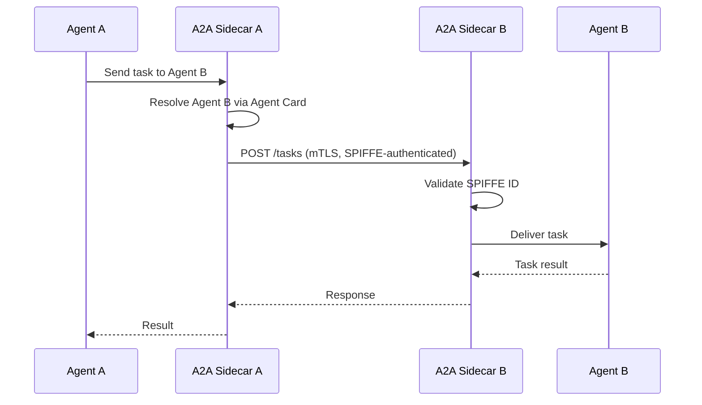

## What It Does

The A2A Sidecar runs in every agent pod with A2A enabled. It:

1. **Publishes** the agent's capabilities via Agent Card
2. **Receives** incoming A2A task requests from other agents
3. **Routes** tasks to the agent container
4. **Stores** task state in Valkey for reliable delivery

---

## Protocol

The A2A protocol follows Google's [Agent-to-Agent](https://google.github.io/A2A/) specification with Hexr extensions for SPIFFE identity.



---

## Endpoints

| Method | Path | Description |
|--------|------|-------------|
| `GET` | `/.well-known/agent.json` | Agent Card (capabilities, skills) |
| `POST` | `/tasks` | Submit a new task |
| `GET` | `/tasks/:id` | Get task status/result |
| `DELETE` | `/tasks/:id` | Cancel a task |
| `GET` | `/health` | Health check |

---

## Agent Card

Published at `/.well-known/agent.json`:

```json
{
  "name": "research-analyst",
  "description": "Performs web research and data analysis",
  "url": "http://research-analyst-a2a.tenant-acme.svc:8090",
  "version": "1.0.0",
  "capabilities": {
    "streaming": false,
    "pushNotifications": false
  },
  "skills": [
    {
      "id": "web-research",
      "name": "Web Research",
      "description": "Search the web and synthesize findings"
    }
  ],
  "authentication": {
    "schemes": ["spiffe-mtls"]
  },
  "hexr": {
    "spiffeId": "spiffe://hexr.cloud/agent/acme/research-analyst/main",
    "tenant": "acme-corp"
  }
}
```

---

## Discovery

Agents discover each other via Kubernetes DNS:

```
{agent-name}-a2a.{namespace}.svc.cluster.local:8090
```

The A2A sidecar queries the Kubernetes API for Agent Card ConfigMaps in the same namespace.

---

## Configuration

| Environment Variable | Default | Description |
|---------------------|---------|-------------|
| `LISTEN_PORT` | `8090` | A2A endpoint port |
| `AGENT_HOST` | `localhost` | Agent container address |
| `AGENT_PORT` | `8080` | Agent container port |
| `VALKEY_URL` | `valkey.hexr-system:6379` | Task state storage |
| `SPIRE_AGENT_SOCKET` | `/run/spire/sockets/agent.sock` | SPIFFE identity |

---

## Image

```
us-central1-docker.pkg.dev/hexr-cloud-prod/hexr-images/a2a-sidecar:v0.1.1
```
