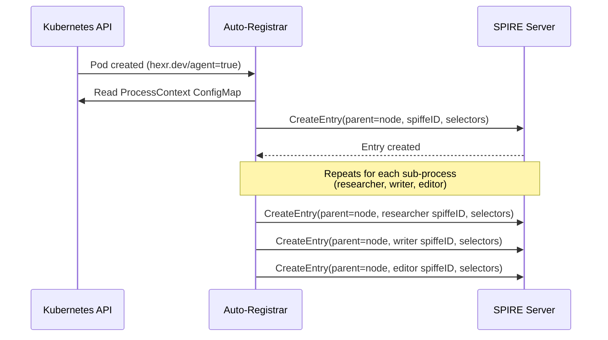

## What It Does

The Auto-Registrar is a Kubernetes controller that:

1. **Watches** for pods with the label `hexr.dev/agent: "true"`
2. **Reads** the pod's process context ConfigMap
3. **Creates** SPIRE registration entries for each process identity
4. **Maps** `hexr_tool()` service names → SPIFFE ID DNS SANs

---

## How It Works



---

## Registration Entry Format

For each process in an agent pod, the registrar creates:

```
SPIFFE ID: spiffe://{trust-domain}/agent/{tenant}/{agent-name}/{role}

Selectors:
  - k8s:pod-uid:{pod-uid}
  - k8s:ns:{namespace}
  - k8s:sa:{service-account}
  - hexr:role:{role}

DNS Names:
  - {agent-name}.{namespace}.svc
  - {agent-name}-a2a.{namespace}.svc
```

---

## Pod Labels

The Auto-Registrar watches for these labels:

| Label | Required | Description |
|-------|----------|-------------|
| `hexr.dev/agent: "true"` | Yes | Marks pod for registration |
| `hexr.dev/tenant` | Yes | Tenant identifier |
| `hexr.dev/agent-name` | Yes | Agent name |
| `hexr.dev/trust-domain` | No | Override trust domain |

---

## Configuration

| Environment Variable | Default | Description |
|---------------------|---------|-------------|
| `SPIRE_SERVER_ADDRESS` | `spire-server.spire:8081` | SPIRE Server API address |
| `TRUST_DOMAIN` | `demo.hexr.dev` | Default SPIFFE trust domain |
| `WATCH_NAMESPACES` | `""` (all) | Comma-separated namespaces to watch |
| `LOG_LEVEL` | `info` | Logging level |

---

## Image

```
us-central1-docker.pkg.dev/hexr-cloud-prod/hexr-images/auto-registrar:v0.2.2
```
