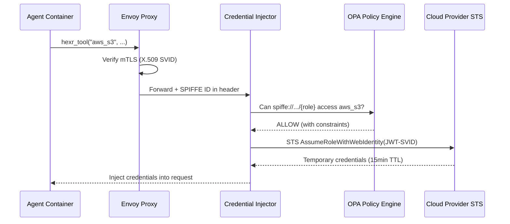

## What It Does

The Credential Injector receives `hexr_tool()` calls from agents, validates their SPIFFE identity, and exchanges it for short-lived cloud credentials (AWS STS, GCP STS, Azure AD).

---

## Exchange Flow



---

## Supported Providers

<CardGroup cols={3}>
  <Card title="AWS" icon="aws">
    STS `AssumeRoleWithWebIdentity` with OIDC federation.
    
    Returns: `AccessKeyId`, `SecretAccessKey`, `SessionToken`
  </Card>
  <Card title="GCP" icon="google">
    Workload Identity Federation via STS token exchange.
    
    Returns: `access_token` (OAuth 2.0)
  </Card>
  <Card title="Azure" icon="microsoft">
    Federated identity credentials via Azure AD.
    
    Returns: `access_token` (Bearer)
  </Card>
</CardGroup>

---

## Three-Tier Cache

Credential lookups are cached at three levels to minimize STS round-trips:

| Tier | Storage | TTL | Latency |
|------|---------|-----|---------|
| **L1** | In-memory (per pod) | 5–15 min | < 1ms |
| **L2** | Valkey (cluster) | 30–60 min | 2–5ms |
| **L3** | Full STS exchange | 15–60 min | 100–500ms |

Cache keys include the SPIFFE ID + service + region, ensuring per-process credential isolation.

---

## OPA Policy Integration

Before exchanging credentials, the Credential Injector queries OPA:

```rego
# Example: Only researchers can access BigQuery
allow {
    input.spiffe_id == "spiffe://hexr.cloud/agent/acme/content-crew/researcher"
    input.service == "gcp_bigquery"
}

# Example: Writers can only write to S3, not read
allow {
    input.spiffe_id == "spiffe://hexr.cloud/agent/acme/content-crew/writer"
    input.service == "aws_s3"
    input.action == "PutObject"
}
```

---

## Configuration

| Environment Variable | Default | Description |
|---------------------|---------|-------------|
| `SPIRE_AGENT_SOCKET` | `/run/spire/sockets/agent.sock` | SPIRE Agent socket |
| `AWS_ROLE_ARN` | — | AWS IAM role for STS federation |
| `GCP_WORKLOAD_IDENTITY_PROVIDER` | — | GCP WIF provider path |
| `AZURE_TENANT_ID` | — | Azure AD tenant |
| `VALKEY_URL` | `valkey.hexr-system:6379` | L2 cache endpoint |
| `CACHE_TTL_L1` | `900` | L1 cache TTL in seconds |
| `CACHE_TTL_L2` | `3600` | L2 cache TTL in seconds |

---

## Image

```
us-central1-docker.pkg.dev/hexr-cloud-prod/hexr-images/cred-injector:v0.4.2
```
