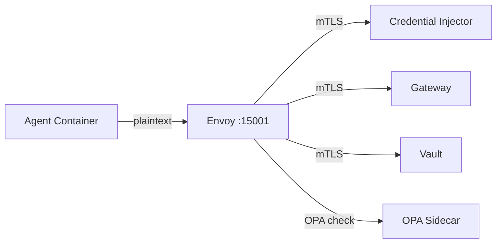

## What It Does

Every agent pod includes an Envoy proxy sidecar that:

1. **Terminates mTLS** using the agent's X.509 SVID
2. **Extracts SPIFFE ID** from the client certificate
3. **Queries OPA** for authorization decisions
4. **Routes traffic** to platform services (Gateway, Vault, Credential Injector)
5. **Emits metrics** for every request

---

## Traffic Flow



All outbound traffic from the agent container passes through Envoy, which upgrades it to mTLS using the process-specific SVID.

---

## OPA Integration

Envoy calls OPA as an external authorization filter:

```
Agent → Envoy → OPA (allow/deny) → Target Service
```

OPA policies can enforce:
- Which processes can access which services
- Rate limiting per identity
- Time-based access restrictions
- Region-based routing

---

## Ports

| Port | Purpose |
|------|---------|
| `15001` | Outbound listener (agent traffic) |
| `15006` | Inbound listener (A2A traffic) |
| `15090` | Prometheus metrics |
| `15021` | Health check |

---

## Configuration

Envoy is configured via xDS from the Hexr control plane, not static config files. Key settings:

| Setting | Value |
|---------|-------|
| Trust domain | Matches SPIRE trust domain |
| SDS (Secret Discovery) | SPIRE Agent Workload API |
| Authorization | OPA external authz filter |
| Access log | JSON format, includes SPIFFE IDs |
