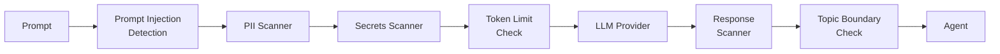

## What It Does

LLM Guard intercepts all `hexr_llm()` calls and scans prompts and responses for security threats using multiple detection strategies.

---

## Scanning Pipeline



---

## Scanners

| Scanner | Direction | What It Catches |
|---------|-----------|----------------|
| **Prompt Injection** | Input | Jailbreak attempts, system prompt extraction, role-play attacks |
| **PII Detection** | Input + Output | Email addresses, phone numbers, SSNs, credit cards |
| **Secrets Detection** | Input + Output | API keys, passwords, tokens, private keys |
| **Token Limit** | Input | Prevents context window overflow attacks |
| **Topic Boundary** | Output | Detects off-topic responses that may indicate manipulation |

---

## OWASP Top 10 for GenAI Coverage

| OWASP Risk | LLM Guard Protection |
|------------|---------------------|
| LLM01: Prompt Injection | Prompt injection scanner |
| LLM02: Insecure Output | Response content scanner |
| LLM06: Sensitive Information | PII + secrets scanner |
| LLM07: Insecure Plugin Design | Gateway credential scoping |
| LLM09: Overreliance | Topic boundary check |

---

## Integration

LLM Guard is automatically invoked by `hexr_llm()` — no code changes required:

```python
# LLM Guard scans this prompt before it reaches OpenAI
response = hexr_llm(
    provider="openai",
    model="gpt-4o",
    prompt="Analyze this customer data: ...",
)
# LLM Guard scans the response before returning
```

To manually scan:

```python
from hexr.guard import scan_prompt, scan_output

result = scan_prompt("user input here")
if result.flagged:
    print(f"Blocked: {result.scanner} - {result.reason}")
```

---

## Configuration

| Environment Variable | Default | Description |
|---------------------|---------|-------------|
| `ENABLED_SCANNERS` | `all` | Comma-separated list of active scanners |
| `PII_DETECTION_THRESHOLD` | `0.85` | Confidence threshold for PII detection |
| `INJECTION_DETECTION_MODEL` | `built-in` | Prompt injection detection model |
| `BLOCK_ON_DETECTION` | `true` | Block or warn on detection |
