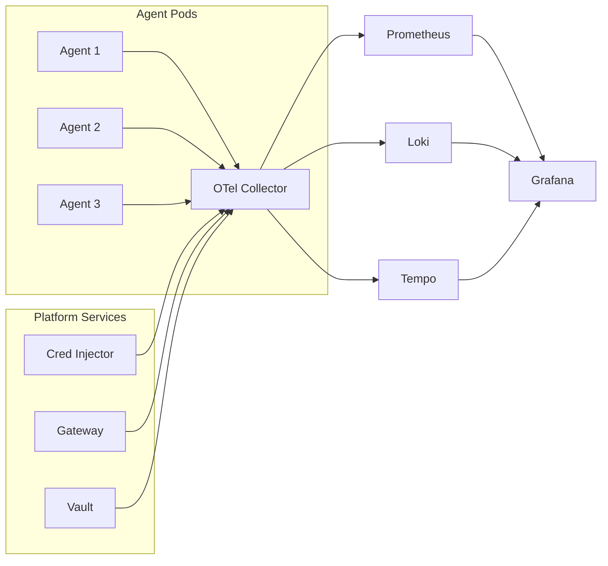

## Components

| Component | Role |
|-----------|------|
| **OTel Collector** | Receives traces, metrics, and logs from all agents |
| **Prometheus** | Time-series metrics storage and alerting |
| **Grafana** | Dashboards and visualization |
| **Loki** | Log aggregation |
| **Tempo** (optional) | Distributed trace storage |

---

## Data Flow



---

## Auto-Instrumented Spans

The Hexr SDK automatically generates OpenTelemetry spans:

| Span Name | Triggered By |
|-----------|-------------|
| `hexr.agent.invoke` | `@hexr_agent` decorated function call |
| `hexr.tool.call` | `hexr_tool()` call |
| `hexr.llm.call` | `hexr_llm()` call |
| `hexr.a2a.send` | `A2AClient.send()` |
| `hexr.vault.get` | `vault.get()` |
| `hexr.sandbox.exec` | `sandbox.exec()` |
| `hexr.browser.browse` | `browser.browse()` |
| `hexr.guard.scan` | LLM Guard scan (automatic) |
| `hexr.cred.exchange` | Credential exchange |

---

## Metrics

### Agent Metrics

| Metric | Type | Description |
|--------|------|-------------|
| `hexr_agent_invocations_total` | Counter | Total agent invocations |
| `hexr_agent_duration_seconds` | Histogram | Agent execution duration |
| `hexr_agent_errors_total` | Counter | Agent errors by type |

### Tool Metrics

| Metric | Type | Description |
|--------|------|-------------|
| `hexr_tool_calls_total` | Counter | Total tool calls by service |
| `hexr_tool_duration_seconds` | Histogram | Tool call duration |
| `hexr_tool_errors_total` | Counter | Tool errors by service |
| `hexr_cred_cache_hits_total` | Counter | Cache hits by tier (L1/L2/L3) |

### LLM Metrics (GenAI Semantic Conventions)

| Metric | Type | Description |
|--------|------|-------------|
| `gen_ai_client_token_usage` | Histogram | Tokens by direction (input/output) |
| `gen_ai_client_operation_duration` | Histogram | LLM call duration |
| `hexr_llm_cost_dollars` | Counter | Estimated cost by model + tenant |

---

## Grafana Dashboards

The platform ships with pre-built Grafana dashboards:

| Dashboard | Shows |
|-----------|-------|
| **Agent Overview** | All agents, invocations, errors, latency |
| **Tool Usage** | Tool calls by service, cache hit rates, latency |
| **LLM Costs** | Token usage, cost per tenant, model distribution |
| **Security** | Guard blocks, credential exchanges, audit events |
| **Infrastructure** | Pod health, SPIRE status, Envoy metrics |

Access Grafana at the configured endpoint (Hexr Cloud: available via dashboard).

---

## Configuration

OTel Collector is configured via `otel-collector-config.yaml`:

```yaml
receivers:
  otlp:
    protocols:
      grpc:
        endpoint: 0.0.0.0:4317
      http:
        endpoint: 0.0.0.0:4318

exporters:
  prometheus:
    endpoint: 0.0.0.0:8889
  loki:
    endpoint: http://loki:3100/loki/api/v1/push

processors:
  batch:
    timeout: 5s
    send_batch_size: 1024
```
