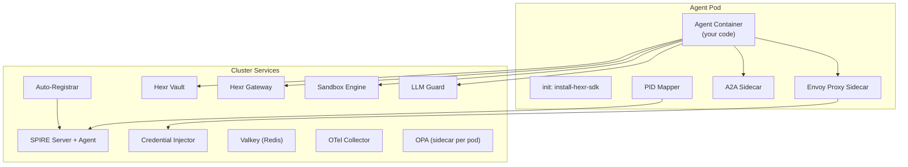

## Architecture

Every Hexr agent pod runs as a **bare Kubernetes Pod** (not a Deployment) with these containers:

---

## Pod Containers

| Container | Purpose | Port |
|-----------|---------|------|
| [Agent Container](/platform/agent-container) | Your Python code + Hexr SDK | — |
| [Envoy Proxy](/platform/envoy-proxy) | mTLS termination, traffic routing, OPA sidecall | 15001 |
| [A2A Sidecar](/platform/a2a-sidecar) | Agent-to-agent protocol handler | 8090 |
| [PID Mapper](/platform/pid-mapper) | Per-process identity → SPIRE registration | — |

---

## Cluster Services

| Service | Purpose | Docs |
|---------|---------|------|
| [SPIRE](/platform/spire) | SPIFFE identity issuance (X.509 SVIDs) | [→](/platform/spire) |
| [Auto-Registrar](/platform/auto-registrar) | Watches pods, creates SPIRE registration entries | [→](/platform/auto-registrar) |
| [Credential Injector](/platform/credential-injector) | SPIFFE → cloud credentials (STS exchange) | [→](/platform/credential-injector) |
| [Hexr Vault](/platform/vault-service) | Encrypted secret storage (AES-256-GCM) | [→](/platform/vault-service) |
| [Hexr Gateway](/platform/gateway-service) | Tool registry + credential-injecting proxy | [→](/platform/gateway-service) |
| [Sandbox Engine](/platform/sandbox) | Firecracker-isolated code execution | [→](/platform/sandbox) |
| [LLM Guard](/platform/llm-guard) | Prompt/response security scanning | [→](/platform/llm-guard) |
| [Valkey](/platform/valkey) | In-cluster cache (L2 credentials, A2A tasks) | [→](/platform/valkey) |
| [OTel Collector](/platform/observability-stack) | Telemetry pipeline (traces, metrics, logs) | [→](/platform/observability-stack) |
| [Dashboard](/platform/dashboard) | Management UI | [→](/platform/dashboard) |
| [Cloud API](/platform/cloud-api) | Metering, tenant management, API keys | [→](/platform/cloud-api) |
