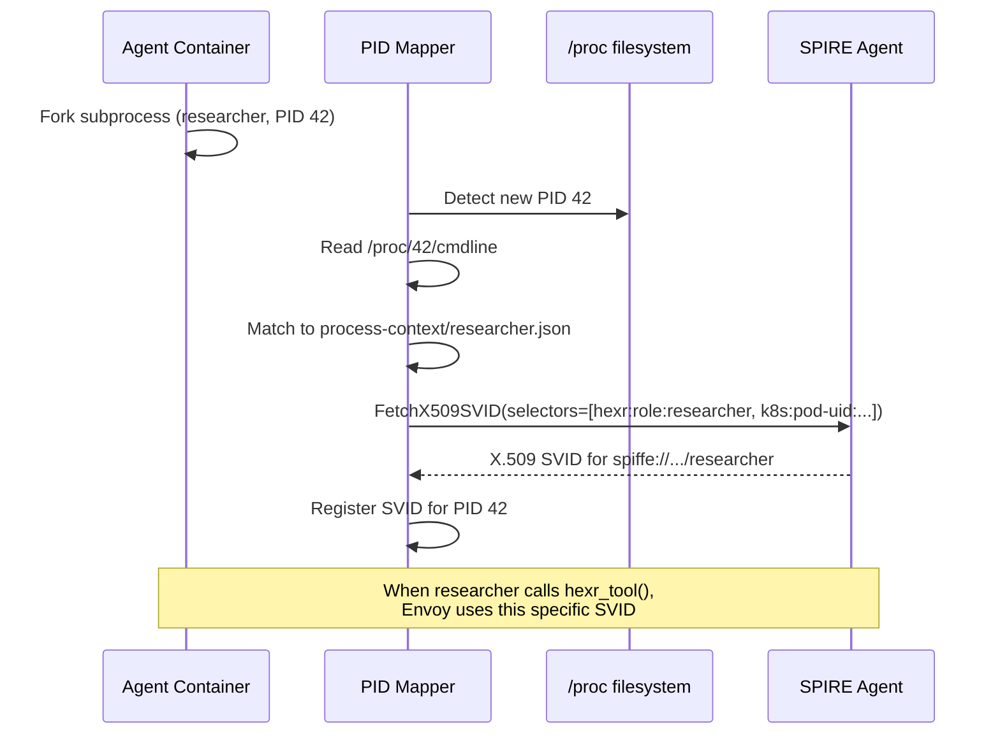

## What It Does

The PID Mapper is the core innovation that enables **per-process identity**. It runs as a sidecar container with `shareProcessNamespace: true`, giving it visibility into all processes in the pod.

When a new process starts in the agent container (e.g., a CrewAI spawns a researcher subprocess), the PID Mapper:

1. **Detects** the new process via `/proc` filesystem monitoring
2. **Matches** the process to a role from the process context ConfigMap
3. **Requests** a unique SPIFFE SVID for that specific process
4. **Delivers** the SVID so the process gets its own cryptographic identity

---

## How It Works



---

## Process Context

The PID Mapper reads from a ConfigMap mounted at `/hexr/process-contexts/`:

```json
{
  "role": "researcher",
  "command_pattern": "python.*researcher",
  "spiffe_suffix": "researcher",
  "allowed_services": ["gcp_bigquery", "aws_s3"],
  "env_markers": {
    "HEXR_ROLE": "researcher"
  }
}
```

---

## Detection Methods

The PID Mapper uses multiple strategies to match a process to a role:

| Priority | Method | How |
|----------|--------|-----|
| 1 | **Environment variable** | `HEXR_ROLE=researcher` in process env |
| 2 | **Command pattern** | Regex match against `/proc/{pid}/cmdline` |
| 3 | **Process tree** | Parent-child relationship analysis |
| 4 | **Fallback** | Assign `main` role |

---

## Why This Matters

Without PID Mapper, all processes in a container share one identity. With it:

| Without PID Mapper | With PID Mapper |
|-------------------|-----------------|
| All processes share one SVID | Each process gets a unique SVID |
| `hexr_tool()` grants broad access | `hexr_tool()` grants role-specific access |
| No per-process cost attribution | Per-process LLM cost tracking |
| One identity in audit logs | Per-process audit trail |

<Warning>
  PID Mapper requires `shareProcessNamespace: true` in the pod spec. This is 
  automatically configured by `hexr build`.
</Warning>

---

## Configuration

The PID Mapper is configured via pod spec, not environment variables:

```yaml
spec:
  shareProcessNamespace: true
  containers:
    - name: pid-mapper
      image: us-central1-docker.pkg.dev/hexr-cloud-prod/hexr-images/enterprise-pid-mapper:latest
      volumeMounts:
        - name: spire-agent-socket
          mountPath: /run/spire/sockets
        - name: process-contexts
          mountPath: /hexr/process-contexts
```
