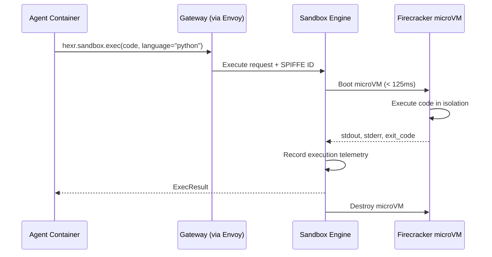

## What It Does

The Sandbox Engine provides isolated code execution environments for AI agents. When an agent calls `hexr.sandbox.exec()`, the code runs inside a **Firecracker microVM** — completely isolated from the host and other agents.

---

## Security Model

| Layer | Protection |
|-------|-----------|
| **Firecracker microVM** | Hardware-level isolation (KVM) |
| **No network** | No outbound network by default |
| **Read-only rootfs** | Cannot modify the execution environment |
| **Resource limits** | CPU, memory, and time bounded |
| **No persistent state** | VM destroyed after execution |

---

## Execution Flow



---

## Supported Languages

| Language | Runtime |
|----------|---------|
| Python 3.11 | CPython with numpy, pandas, scipy |
| JavaScript | Node.js 20 |
| Bash | GNU Bash 5 |

---

## API

| Method | Path | Description |
|--------|------|-------------|
| `POST` | `/api/v1/exec` | Execute code |
| `GET` | `/health` | Health check |

### Request Body

```json
{
  "code": "import pandas as pd\nprint(pd.DataFrame({'a': [1,2,3]}).describe())",
  "language": "python",
  "timeout": 30,
  "memory_mb": 256
}
```

### Response Body

```json
{
  "stdout": "         a\ncount  3.0\nmean   2.0\n...",
  "stderr": "",
  "exit_code": 0,
  "execution_time_ms": 234,
  "memory_used_mb": 45
}
```

---

## Configuration

| Environment Variable | Default | Description |
|---------------------|---------|-------------|
| `MAX_EXECUTION_TIME` | `30s` | Maximum execution time |
| `MAX_MEMORY_MB` | `512` | Maximum memory per VM |
| `LISTEN_ADDRESS` | `:8080` | HTTP listen address |
| `FIRECRACKER_BIN` | `/usr/bin/firecracker` | Firecracker binary path |

---

## Image

```
us-central1-docker.pkg.dev/hexr-cloud-prod/hexr-images/hexr-sandbox:v0.2.1
```
