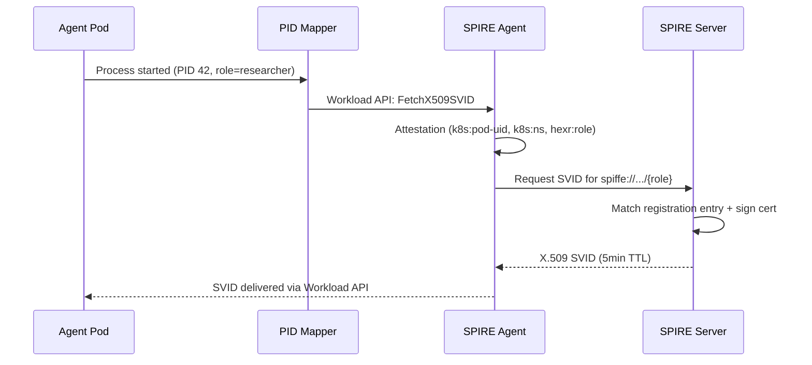

## What It Does

SPIRE (SPIFFE Runtime Environment) is the **identity foundation** of Hexr. It issues cryptographic identities to every agent process using the SPIFFE standard.

---

## Components

| Component | Role | Runs As |
|-----------|------|---------|
| **SPIRE Server** | Certificate authority, registration store | StatefulSet in `spire` namespace |
| **SPIRE Agent** | Node-level attestor, workload API provider | DaemonSet (every node) |
| **OIDC Discovery** | Publishes JWKS for cloud federation | Deployment at `oidc.hexr.cloud` |

---

## Identity Issuance Flow



---

## SPIFFE ID Format

```
spiffe://{trust-domain}/agent/{tenant}/{agent-name}/{role}
```

Examples:
```
spiffe://hexr.cloud/agent/acme-corp/research-analyst/main
spiffe://hexr.cloud/agent/acme-corp/content-crew/researcher
spiffe://hexr.cloud/agent/acme-corp/content-crew/writer
spiffe://demo.hexr.dev/agent/dev-team/my-agent/main
```

---

## Trust Domains

| Domain | Environment |
|--------|-------------|
| `hexr.cloud` | Production (Hexr Cloud) |
| `demo.hexr.dev` | Development / self-hosted default |
| Custom | Configurable per deployment |

---

## OIDC Discovery

SPIRE publishes a JWKS endpoint at `oidc.hexr.cloud/.well-known/openid-configuration`, enabling cloud providers to validate JWT-SVIDs for credential exchange:

```
https://oidc.hexr.cloud/.well-known/openid-configuration
https://oidc.hexr.cloud/keys
```

This is how `hexr_tool()` credential exchange works — cloud providers trust the SPIRE OIDC endpoint as an identity provider.

---

## Helm Values

Key SPIRE configuration in Helm `values-saas.yaml`:

```yaml
spire:
  server:
    trustDomain: hexr.cloud
    ca:
      ttl: 24h
    registration:
      enabled: true
  agent:
    socketPath: /run/spire/sockets/agent.sock
  oidc:
    enabled: true
    hostname: oidc.hexr.cloud
```
