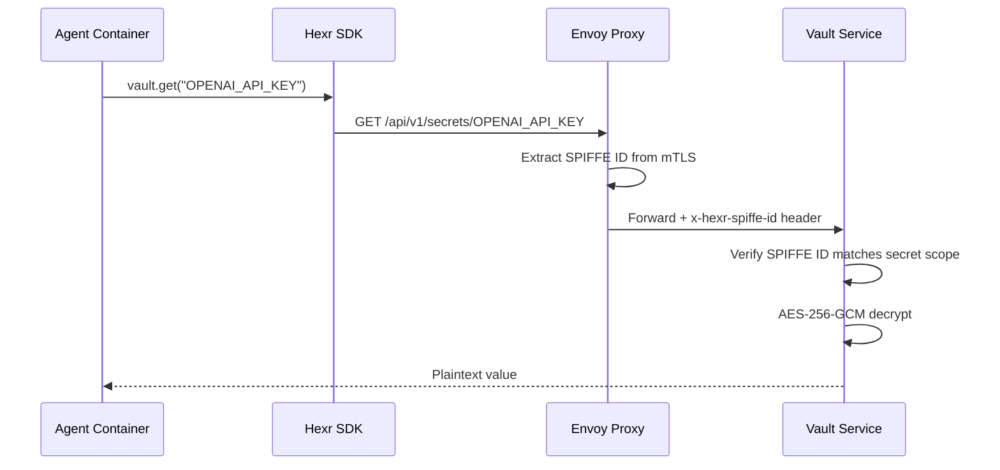

## What It Does

Hexr Vault provides encrypted secret storage for AI agents. Secrets are:

- **Encrypted at rest** with AES-256-GCM
- **Scoped per agent** using SPIFFE ID — agents can only access their own secrets
- **Stored in PostgreSQL** (no external vault dependency)
- **Accessible via SDK** through `hexr.vault` module

---

## How Access Works



---

## Scoping Model

Secrets are scoped to a SPIFFE ID prefix:

| Scope | SPIFFE ID Pattern | Who Can Access |
|-------|-------------------|----------------|
| **Agent-level** | `spiffe://hexr.cloud/agent/acme/research-analyst/*` | All processes in the agent |
| **Process-level** | `spiffe://hexr.cloud/agent/acme/research-analyst/researcher` | Only the researcher sub-process |
| **Tenant-level** | `spiffe://hexr.cloud/agent/acme/*` | All agents in tenant |

---

## Storage

| Field | Description |
|-------|-------------|
| `key` | Secret name (e.g., `OPENAI_API_KEY`) |
| `value` | AES-256-GCM encrypted bytes |
| `nonce` | Per-secret random nonce |
| `spiffe_scope` | SPIFFE ID prefix for access control |
| `created_at` | Creation timestamp |
| `updated_at` | Last update timestamp |

Backend: PostgreSQL with the `pgcrypto` extension.

---

## API Endpoints

| Method | Path | Description |
|--------|------|-------------|
| `GET` | `/api/v1/secrets/:key` | Retrieve a secret |
| `PUT` | `/api/v1/secrets/:key` | Create or update a secret |
| `DELETE` | `/api/v1/secrets/:key` | Delete a secret |
| `GET` | `/api/v1/secrets` | List secret keys (not values) |
| `GET` | `/health` | Health check |

---

## Configuration

| Environment Variable | Default | Description |
|---------------------|---------|-------------|
| `DATABASE_URL` | — | PostgreSQL connection string |
| `ENCRYPTION_KEY` | — | AES-256 master encryption key |
| `LISTEN_ADDRESS` | `:8080` | HTTP listen address |

---

## Image

```
us-central1-docker.pkg.dev/hexr-cloud-prod/hexr-images/hexr-vault:v0.1.1
```
