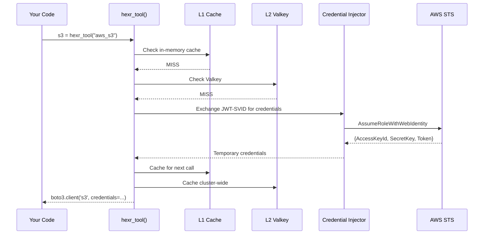

## Signature

```python
hexr_tool(service_name: str, region: str | None = None, **kwargs) -> Any
```

---

## Parameters

<ParamField path="service_name" type="string" required>
  The cloud service to authenticate. Uses the format `{provider}_{service}`.
  
  Examples: `"aws_s3"`, `"gcp_bigquery"`, `"azure_storage"`
</ParamField>

<ParamField path="region" type="string" default="None">
  Override the default region for this service.
  
  Example: `"us-west-2"`, `"europe-west1"`
</ParamField>

---

## Returns

An authenticated client from the cloud provider's SDK:

| Service | Returns |
|---------|---------|
| `aws_s3` | `boto3.client('s3')` |
| `aws_ec2` | `boto3.client('ec2')` |
| `aws_dynamodb` | `boto3.resource('dynamodb')` |
| `aws_sqs` | `boto3.client('sqs')` |
| `aws_lambda` | `boto3.client('lambda')` |
| `aws_bedrock` | `boto3.client('bedrock-runtime')` |
| `gcp_bigquery` | `google.cloud.bigquery.Client()` |
| `gcp_storage` | `google.cloud.storage.Client()` |
| `gcp_vertexai` | `google.cloud.aiplatform` client |
| `gcp_pubsub` | `google.cloud.pubsub_v1.PublisherClient()` |
| `azure_storage` | `azure.storage.blob.BlobServiceClient()` |
| `azure_cosmosdb` | `azure.cosmos.CosmosClient()` |
| `azure_openai` | `openai.AzureOpenAI()` |

---

## Basic Usage

```python
from hexr import hexr_agent, hexr_tool

@hexr_agent(name="data-pipeline", tenant="acme-corp")
def process():
    # Returns authenticated boto3 S3 client
    s3 = hexr_tool("aws_s3")
    
    # Use it exactly like normal boto3
    response = s3.list_buckets()
    for bucket in response['Buckets']:
        print(bucket['Name'])
    
    # Upload a file
    s3.upload_file('data.csv', 'my-bucket', 'data.csv')
```

**Output:**
```
my-data-bucket
my-logs-bucket
my-models-bucket
```

---

## How It Works

<Frame>

</Frame>

---

## Multi-Cloud Example

```python
@hexr_agent(
    name="multi-cloud-analyst",
    tenant="acme-corp",
    resources=["aws_s3", "gcp_bigquery", "azure_storage"]
)
def cross_cloud_analysis():
    # Each call targets a different cloud provider's STS
    s3 = hexr_tool("aws_s3")           # → AWS STS
    bq = hexr_tool("gcp_bigquery")     # → GCP Workload Identity Federation
    blob = hexr_tool("azure_storage")  # → Azure Federated Token
    
    # Query BigQuery
    rows = bq.query("SELECT * FROM sales.transactions LIMIT 1000")
    
    # Store results in S3
    import json
    s3.put_object(
        Bucket="cross-cloud-results",
        Key="analysis.json",
        Body=json.dumps([dict(row) for row in rows])
    )
    
    return f"Processed {rows.total_rows} rows"
```

---

## Region Override

```python
# Default region (from agent config or environment)
s3_default = hexr_tool("aws_s3")

# Specific region
s3_eu = hexr_tool("aws_s3", region="eu-west-1")
s3_ap = hexr_tool("aws_s3", region="ap-southeast-1")
```

---

## Error Handling

```python
from hexr import hexr_tool, CredentialError, AuthenticationError

try:
    s3 = hexr_tool("aws_s3")
except AuthenticationError:
    # SPIFFE identity not available (not running in Hexr pod)
    print("Not running in a Hexr-managed environment")
except CredentialError as e:
    # Credential exchange failed (OPA denied, STS error, etc.)
    print(f"Credential exchange failed: {e}")
```

---

## OPA Policy Scoping

The `resources` parameter on `@hexr_agent` tells OPA which services this agent is allowed to access:

```python
@hexr_agent(
    name="read-only-agent",
    tenant="acme-corp",
    resources=["aws_s3:read"]  # Only read access
)
def read_data():
    s3 = hexr_tool("aws_s3")     # ✅ Allowed
    ec2 = hexr_tool("aws_ec2")   # ❌ OPA denies — not in resources list
```

---

## Observability

Every `hexr_tool()` call emits OpenTelemetry data:

**Span:** `hexr.tool.invoke`
```
Attributes:
  service: "aws_s3"
  region: "us-west-2"
  cache_tier: "L1" | "L2" | "L3"
  duration_ms: 0.001 | 2.3 | 150
```

**Metrics:**
- `hexr.tool.invocations` — Counter by service
- `hexr.tool.duration` — Histogram of call latency
- `hexr.cache.hits` / `hexr.cache.misses` — Cache performance
