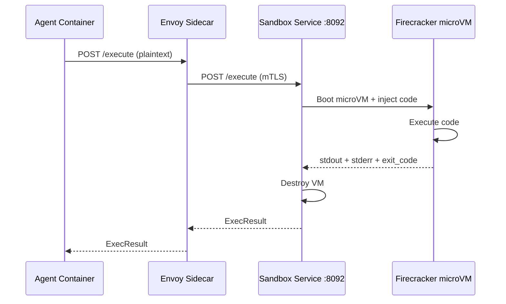

## Quick Start

```python
import hexr.sandbox

result = hexr.sandbox.exec("""
import pandas as pd
df = pd.DataFrame({'x': [1, 2, 3], 'y': [4, 5, 6]})
print(df.describe())
""")

print(result.stdout)
```

**Output:**
```
              x         y
count  3.000000  3.000000
mean   2.000000  5.000000
std    1.000000  1.000000
min    1.000000  4.000000
25%    1.500000  4.500000
50%    2.000000  5.000000
75%    2.500000  5.500000
max    3.000000  6.000000
```

---

## API

### hexr.sandbox.exec()

```python
hexr.sandbox.exec(
    code: str,
    *,
    language: str = "python",
    timeout: int = 30,
    env_vars: dict = None,
    packages: list[str] = None
) -> ExecResult
```

<ParamField path="code" type="string" required>
  The code to execute inside the microVM.
</ParamField>

<ParamField path="language" type="string" default="python">
  Execution language. `"python"` or `"shell"`.
</ParamField>

<ParamField path="timeout" type="int" default="30">
  Maximum execution time in seconds. The VM is killed after this.
</ParamField>

<ParamField path="env_vars" type="dict" default="None">
  Environment variables to set inside the VM.
  
  ```python
  result = hexr.sandbox.exec(
      "import os; print(os.environ['MY_VAR'])",
      env_vars={"MY_VAR": "hello"}
  )
  ```
</ParamField>

<ParamField path="packages" type="list[str]" default="None">
  Python packages to install before execution.
  
  ```python
  result = hexr.sandbox.exec(
      "import numpy; print(numpy.random.rand(3))",
      packages=["numpy"]
  )
  ```
</ParamField>

### ExecResult

```python
result = hexr.sandbox.exec("print('hello')")

result.stdout       # "hello\n"
result.stderr       # ""
result.exit_code    # 0
result.duration_ms  # 1234
result.ok           # True (exit_code == 0)
result.output       # Alias for stdout
```

### Async Version

```python
result = await hexr.sandbox.exec_async("print('hello')")
```

### Check Availability

```python
if hexr.sandbox.is_enabled():
    result = hexr.sandbox.exec("print('sandbox available')")
else:
    print("Sandbox not available in this environment")
```

---

## Examples

### Data Analysis

```python
result = hexr.sandbox.exec("""
import pandas as pd
import json

data = [
    {"name": "Alice", "score": 92},
    {"name": "Bob", "score": 85},
    {"name": "Charlie", "score": 78}
]
df = pd.DataFrame(data)
print(json.dumps({
    "mean": df['score'].mean(),
    "median": df['score'].median(),
    "std": df['score'].std()
}))
""", packages=["pandas"])

import json
stats = json.loads(result.stdout)
```

### Shell Commands

```python
result = hexr.sandbox.exec(
    "ls -la /tmp && whoami && cat /etc/os-release",
    language="shell"
)
print(result.stdout)
```

### Error Handling

```python
result = hexr.sandbox.exec("1/0")  # ZeroDivisionError

if not result.ok:
    print(f"Exit code: {result.exit_code}")
    print(f"Error: {result.stderr}")
```

---

## Security Model

<Warning>
  Code inside the sandbox runs in a **Firecracker microVM** with hardware-level isolation. 
  It has **no access** to SPIFFE identity, cloud credentials, Vault secrets, or the Kubernetes 
  cluster network.
</Warning>

| Property | Detail |
|----------|--------|
| **Isolation** | Firecracker microVM (KVM-based) — hardware boundary |
| **Network** | No access to cluster services or internet (by default) |
| **Identity** | No SPIFFE socket mounted — code cannot impersonate the agent |
| **Credentials** | No cloud credentials available inside the VM |
| **Lifecycle** | Fresh VM per execution — no state persists between calls |
| **Resource limits** | Memory and CPU capped per execution |

This means even if sandboxed code is malicious (e.g., prompt injection leads to code execution), it cannot:
- Access Vault secrets
- Call cloud APIs with agent credentials
- Communicate with other agents
- Read the SPIRE socket
- Escape to the host

---

## Architecture

<Frame>

</Frame>

Built on [SmolVM](https://github.com/nicholasgasior/smolvm) — a thin Firecracker wrapper (Apache-2.0).
