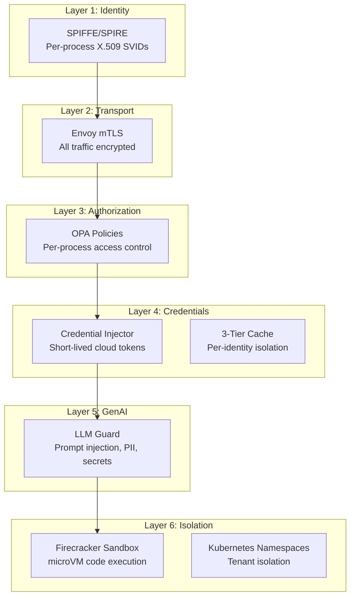

## Security Principles

Hexr is built on three security principles:

1. **Identity-first** — every process has a cryptographic SPIFFE identity
2. **Zero standing access** — credentials are short-lived and scoped
3. **Defense-in-depth** — multiple layers, no single point of failure

---

## Security Layers

---

## What Each Layer Protects

| Layer | Threat | Protection |
|-------|--------|-----------|
| **SPIFFE Identity** | Impersonation, unauthorized access | Cryptographic proof of identity |
| **mTLS** | Eavesdropping, MITM attacks | All traffic encrypted with X.509 certs |
| **OPA Policies** | Overprivileged access | Per-process, per-service authorization |
| **Credential Injector** | Credential leakage, long-lived keys | 15-minute tokens, auto-rotated |
| **LLM Guard** | Prompt injection, PII leakage | Multi-scanner pipeline |
| **Sandbox** | Arbitrary code execution | Firecracker microVM isolation |
| **Namespaces** | Cross-tenant data access | Kubernetes namespace isolation |

---

## Compliance

| Framework | Status |
|-----------|--------|
| OWASP Top 10 for GenAI | ✅ All 10 risks addressed |
| SOC 2 Type II | Architecture designed for compliance |
| NIST AI RMF | Identity and risk controls aligned |
| GDPR | PII scanning, data isolation |
| HIPAA | Encryption at rest and in transit |

See [Compliance Frameworks](/security/compliance-frameworks) for details.

---

## Deep Dives

<CardGroup cols={2}>
  <Card title="SPIFFE Identity" icon="fingerprint" href="/security/spiffe-identity">
    How per-process identity works.
  </Card>
  <Card title="OPA Policies" icon="shield-halved" href="/security/opa-policies">
    Write authorization policies.
  </Card>
  <Card title="Threat Model" icon="skull-crossbones" href="/security/threat-model">
    Attack chains and mitigations.
  </Card>
  <Card title="OWASP GenAI" icon="list-check" href="/security/owasp-genai">
    OWASP Top 10 for GenAI compliance.
  </Card>
</CardGroup>
