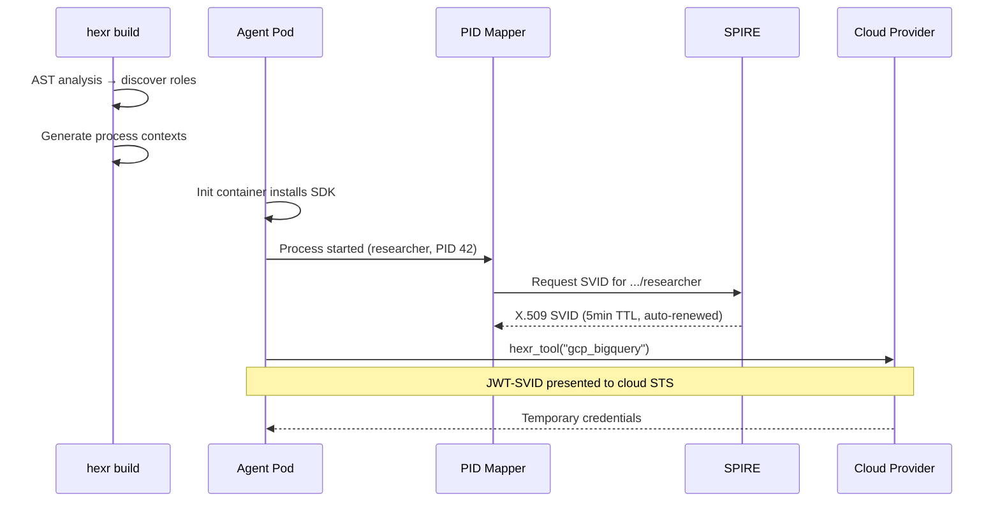

## What Is SPIFFE?

**SPIFFE** (Secure Production Identity Framework for Everyone) is a set of open standards for service identity. A SPIFFE ID is a URI that uniquely identifies a workload:

```
spiffe://hexr.cloud/agent/acme-corp/research-analyst/researcher
         └──────────┘ └────┘ └─────────┘ └────────────────┘ └────────┘
         trust domain  type  tenant       agent name         role
```

## What Is an SVID?

An **SVID** (SPIFFE Verifiable Identity Document) is the cryptographic proof of a SPIFFE ID. Hexr uses two types:

| Type | Format | Used For |
|------|--------|----------|
| **X.509 SVID** | X.509 certificate + private key | mTLS between services |
| **JWT-SVID** | Signed JWT token | Cloud credential exchange (OIDC) |

---

## Per-Process Identity

Hexr's key innovation is assigning a unique SPIFFE ID to each **process** within an agent container — not just the pod:

```
Pod: content-crew (tenant: acme-corp)
├── PID 1 (main)       → spiffe://hexr.cloud/agent/acme-corp/content-crew/main
├── PID 42 (researcher) → spiffe://hexr.cloud/agent/acme-corp/content-crew/researcher
├── PID 43 (writer)     → spiffe://hexr.cloud/agent/acme-corp/content-crew/writer
└── PID 44 (editor)     → spiffe://hexr.cloud/agent/acme-corp/content-crew/editor
```

This enables:
- **Per-role cloud access** — the researcher can access BigQuery but not S3
- **Per-role cost tracking** — attribute LLM costs to each role
- **Per-role audit logs** — know exactly which sub-agent did what

---

## Lifecycle



---

## Trust Domain

| Deployment | Trust Domain |
|-----------|-------------|
| Hexr Cloud | `hexr.cloud` |
| Self-hosted (default) | `demo.hexr.dev` |
| Custom | Configurable via Helm |

---

## Certificate Rotation

SVIDs are short-lived and auto-rotated:

| Certificate | TTL | Rotation |
|-------------|-----|----------|
| X.509 SVID | 5 minutes | SPIRE auto-renews at 50% TTL |
| JWT-SVID | 5 minutes | Issued on-demand for STS exchange |
| CA certificate | 24 hours | SPIRE Server rotates automatically |
